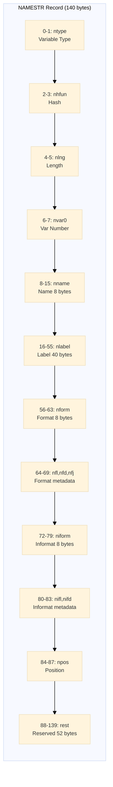
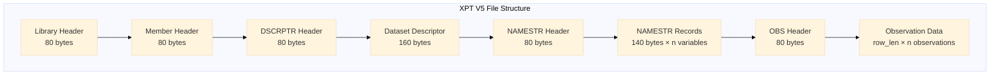
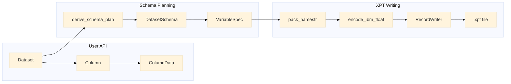
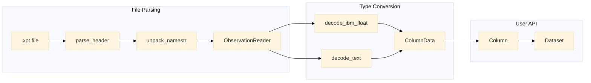
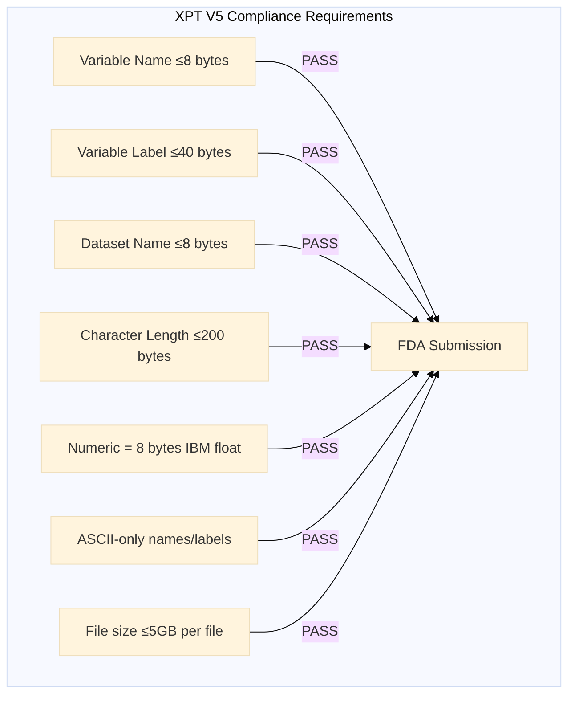
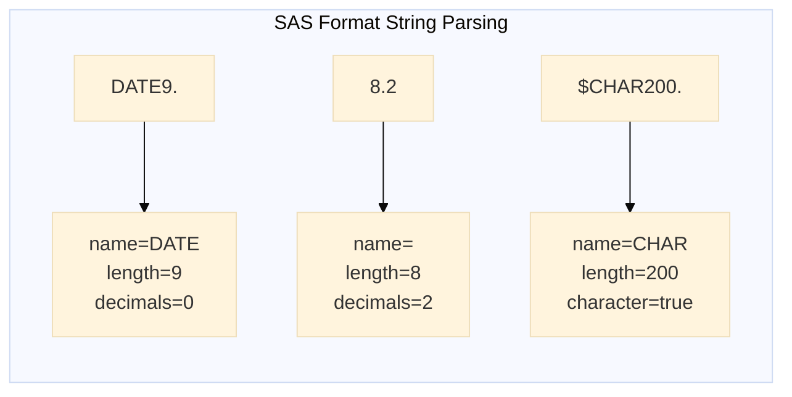
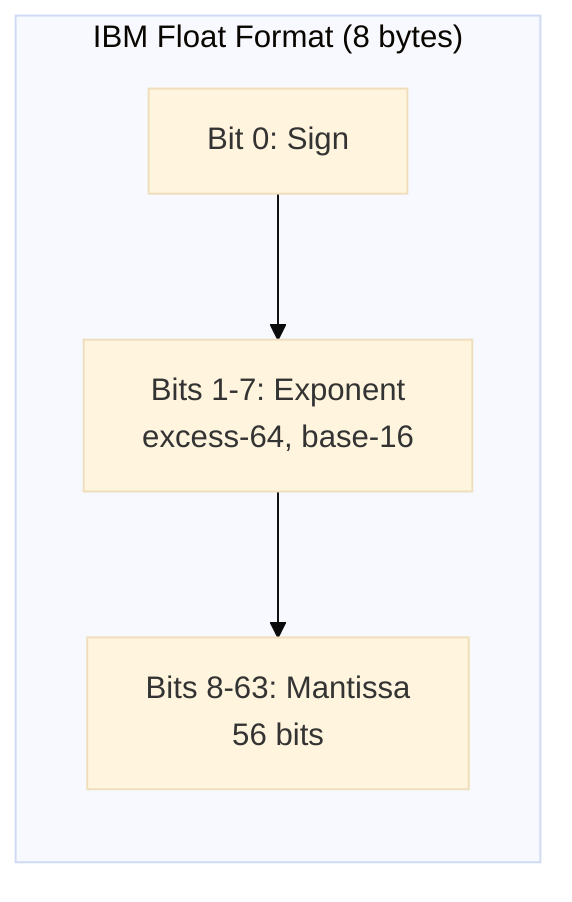

# xportrs Full CDISC/FDA Compliance Rewrite Plan

## Goal

Rewrite the xportrs public API to achieve full CDISC/FDA compliance for XPT V5 format, exposing all required metadata fields (labels, formats, informats) directly on the
`Column` struct.

## Research Sources

- [SAS Technical Note TS-140](https://support.sas.com/content/dam/SAS/support/en/technical-papers/record-layout-of-a-sas-version-5-or-6-data-set-in-sas-transport-xport-format.pdf) - XPT v5 specification
- [FDA Study Data Technical Conformance Guide](https://www.fda.gov/media/153632/download) - FDA requirements
- [CDISC SDTM-IG v3.4](https://www.cdisc.org/standards/foundational/sdtmig/sdtmig-v3-4) - Variable metadata requirements
- [xportr R package](https://atorus-research.github.io/xportr/) - Reference implementation

## What's Already Compliant (No Changes Needed)

| Requirement                                 | Status | Implementation          |
|---------------------------------------------|--------|-------------------------|
| Variable names ≤8 bytes, uppercase A-Z, 0-9 | ✅      | `validate/checks_v5.rs` |
| Variable labels ≤40 bytes                   | ✅      | Validation exists       |
| Dataset names ≤8 bytes                      | ✅      | Validation exists       |
| Dataset labels ≤40 bytes                    | ✅      | `Dataset::with_label()` |
| Character variable length 1-200 bytes       | ✅      | Validation exists       |
| Numeric variables = 8 bytes (IBM float)     | ✅      | Enforced                |
| ASCII-only for FDA/agency compliance        | ✅      | Agency rules            |
| File splitting at 5GB                       | ✅      | `split.rs`              |
| SAS epoch (1960) date handling              | ✅      | `timestamp.rs`          |
| 80-byte record structure                    | ✅      | `record.rs`             |
| IBM float encoding/decoding                 | ✅      | `ibm_float.rs`          |
| No SAS custom formats                       | ✅      | FDA recommends none     |

## Compliance Gaps (Need Fixing)

| Gap                             | Current State                              | Fix                                   |
|---------------------------------|--------------------------------------------|---------------------------------------|
| Variable labels not exposed     | `Column` has no `label` field              | Add `label: Option<Label>` to Column  |
| Format metadata hardcoded to 0  | `pack_namestr` writes nfl=0, nfd=0, nfj=0  | Wire actual values from Column.format |
| No format string parsing        | Format stored as plain string              | Create `Format` type with parser      |
| VariableMetadata not public     | `pub(crate)` visibility                    | Make public                           |
| Character length override       | Auto-derived only                          | Add `length: Option<usize>` to Column |
| **Reading discards metadata**   | `reader.rs:165` only copies name to Column | Transfer label/format from NamestrV5  |
| **No missing label warning**    | Silent on empty labels                     | Add validation warning                |
| **No format syntax validation** | Format strings unchecked                   | Validate on parse                     |

---

## Reading Side Gap (Critical!)

When reading XPT files, all metadata is **discarded**:

```rust,no_run
// src/xpt/v5/read/reader.rs:161-166
let cols: Vec<Column> = member
    .variables
    .iter()
    .zip(columns)
    .map(|(var, data)| Column::new(&var.nname, data))  // ❌ Only name!
    .collect();
```

`NamestrV5` contains: `nlabel`, `nform`, `nfl`, `nfd`, `nfj`, `niform`, `nifl`, `nifd`

All of this is lost when creating `Column`. **Fix**: Transfer metadata to Column during read.

---

## Implementation Phases

### Phase 1: Create Format Type

**File:** `/src/dataset/format.rs` (NEW)

**Research Finding:
** According to [SAS TS-140](https://support.sas.com/content/dam/SAS/support/en/technical-papers/record-layout-of-a-sas-version-5-or-6-data-set-in-sas-transport-xport-format.pdf), the NAMESTR structure stores formats and informats with the same field structure:

- Both have: name (8 bytes), length, decimals
- Format has justification (`nfj`), informat does not

**Decision:** Use **same `Format` type
** for both format and informat. The justification field is only written for formats (set to 0 for informats).

Create a `Format` struct that parses SAS format strings:

- `Format::parse("DATE9.")` → name="DATE", length=9, decimals=0
- `Format::parse("8.2")` → name="", length=8, decimals=2
- `Format::parse("$CHAR200.")` → character format, length=200

Types to create:

- `Format` - parsed format with name, length, decimals, justification
- `Justification` - enum (Left=0, Right=1)
- `FormatParseError` - parsing errors

### Phase 2: Extend Column Struct

**File:** `/src/dataset/domain_dataset.rs`

Add new fields to `Column`:

```rust,no_run
pub struct Column {
    name: VariableName,
    role: Option<VariableRole>,
    data: ColumnData,
    // NEW:
    label: Option<Label>,
    format: Option<Format>,
    informat: Option<Format>,
    length: Option<usize>,  // character length override
}
```

Add builder methods:

- `.with_label(label)`
- `.with_format(Format)`
- `.with_format_str("DATE9.")` → Result
- `.with_informat(Format)`
- `.with_length(usize)`

### Phase 3: Update VariableSpec

**File:** `/src/schema/plan.rs`

Replace string format fields with structured data:

```rust,no_run
pub(crate) struct VariableSpec {
    // ... existing fields ...

    // CHANGED from `format: String`:
    format_name: String,
    format_length: u16,
    format_decimals: u16,
    format_justification: u16,

    informat_name: String,
    informat_length: u16,
    informat_decimals: u16,
}
```

### Phase 4: Update Schema Derivation

**File:** `/src/schema/derive.rs`

In `derive_schema_plan()`, pull metadata from Column:

- `Column.label` → `VariableSpec.label`
- `Column.format` → `VariableSpec.format_*` fields
- `Column.informat` → `VariableSpec.informat_*` fields
- `Column.length` → override character variable length

### Phase 5: Fix pack_namestr

**File:** `/src/xpt/v5/namestr.rs` (lines 155-167)

Replace hardcoded zeros with actual values:

```rust,no_run
// BEFORE (lines 155-157):
cursor.write_i16::<BigEndian>(0)?; // nfl - ALWAYS 0
cursor.write_i16::<BigEndian>(0)?; // nfd - ALWAYS 0
cursor.write_i16::<BigEndian>(0)?; // nfj - ALWAYS 0

// AFTER:
cursor.write_i16::<BigEndian>(var.format_length as i16)?;
cursor.write_i16::<BigEndian>(var.format_decimals as i16)?;
cursor.write_i16::<BigEndian>(var.format_justification as i16)?;
```

Same for informat fields at lines 166-167.

### Phase 6: Fix Reading to Preserve Metadata

**File:** `/src/xpt/v5/read/reader.rs` (lines 161-166)

Transfer metadata from NamestrV5 to Column:

```rust,no_run
// BEFORE:
.map(|(var, data)| Column::new(&var.nname, data))

// AFTER:
.map(|(var, data)| {
    let mut col = Column::new(&var.nname, data);
    if !var.nlabel.is_empty() {
        col = col.with_label(&var.nlabel);
    }
    if !var.nform.is_empty() {
        col = col.with_format(Format::from_namestr(
            &var.nform, var.nfl, var.nfd, var.nfj
        ));
    }
    if !var.niform.is_empty() {
        col = col.with_informat(Format::from_namestr(
            &var.niform, var.nifl, var.nifd, 0
        ));
    }
    col
})
```

Add `Format::from_namestr()` constructor for reconstructing Format from XPT fields.

### Phase 7: Add Validation Warnings

**File:** `/src/validate/checks_v5.rs` and `/src/validate/issues.rs`

**Research Finding:** Pinnacle 21 rule SD0063/SD0063A treats missing/mismatched labels as **WARNING
** severity, not errors. Additionally, SDTM-IG v3.3+ removed variable labels from conformance criteria. Labels are still recommended for reviewer clarity but not strictly required for compliance.

Add new validation issues:

```rust,no_run
// New Issue variants:
Issue::MissingVariableLabel { variable: String }  // WARNING (per SD0063)
Issue::InvalidFormatSyntax { variable: String, format: String }  // Error
```

Add checks:

- Warn (not error) if variable has empty label (recommended for FDA reviewer clarity)
- Validate format string syntax when provided (error if malformed)

### Phase 8: Update Public Exports

**Files:** `/src/lib.rs`, `/src/dataset/mod.rs`, `/src/metadata/mod.rs`

Export new types:

- `Format`, `Justification`, `FormatParseError`
- `VariableMetadata` (change from `pub(crate)` to `pub`)

---

## Files to Modify

| File                             | Changes                                       |
|----------------------------------|-----------------------------------------------|
| `/src/dataset/format.rs`         | NEW - Format type with parsing                |
| `/src/dataset/domain_dataset.rs` | Add label/format/informat/length to Column    |
| `/src/dataset/mod.rs`            | Export Format types                           |
| `/src/schema/plan.rs`            | Structured format fields in VariableSpec      |
| `/src/schema/derive.rs`          | Wire Column metadata to VariableSpec          |
| `/src/xpt/v5/namestr.rs`         | Use actual format values (lines 155-167)      |
| `/src/xpt/v5/read/reader.rs`     | Transfer metadata from NamestrV5 to Column    |
| `/src/validate/checks_v5.rs`     | Add missing label warning                     |
| `/src/validate/issues.rs`        | Add MissingVariableLabel, InvalidFormatSyntax |
| `/src/metadata/variable.rs`      | Update format field type                      |
| `/src/metadata/mod.rs`           | Make VariableMetadata public                  |
| `/src/lib.rs`                    | Export new types                              |

## New Test Files

| File                  | Purpose              |
|-----------------------|----------------------|
| `/tests/v5/format.rs` | Format parsing tests |

Update existing:

- `/tests/v5/write.rs` - Add format metadata roundtrip tests
- `/tests/v5/read.rs` - Verify metadata preserved on read

---

## Example Usage (After Rewrite)

```rust,no_run
use xportrs::{Column, ColumnData, Dataset, Format, Xpt};

let dataset = Dataset::new("AE", vec![
    Column::new("USUBJID", ColumnData::String(vec![Some("001".into())]))
        .with_label("Unique Subject Identifier")
        .with_format(Format::character(20)),

    Column::new("AESTDY", ColumnData::F64(vec![Some(15.0)]))
        .with_label("Study Day of Start")
        .with_format(Format::numeric(8, 0)),

    Column::new("AESTDTC", ColumnData::F64(vec![Some(21185.0)]))
        .with_label("Start Date/Time")
        .with_format_str("DATE9.")?,
])?;

Xpt::writer(dataset)
    .finalize()?
    .write_path("ae.xpt")?;
```

---

## NAMESTR Structure Reference (140 bytes per variable)

From SAS TS-140 specification:

```
Offset  Size  Field     Description
0-1     2     ntype     Variable type: 1=numeric, 2=character
2-3     2     nhfun     Hash (always 0)
4-5     2     nlng      Variable length in bytes
6-7     2     nvar0     Variable number (1-based)
8-15    8     nname     Variable name (space-padded)
16-55   40    nlabel    Variable label (space-padded)  ← NEED TO WIRE
56-63   8     nform     Format name (space-padded)     ← NEED TO WIRE
64-65   2     nfl       Format length                  ← HARDCODED 0
66-67   2     nfd       Format decimals                ← HARDCODED 0
68-69   2     nfj       Format justification           ← HARDCODED 0
70-71   2     nfill     Unused padding
72-79   8     niform    Informat name (space-padded)   ← NEED TO WIRE
80-81   2     nifl      Informat length                ← HARDCODED 0
82-83   2     nifd      Informat decimals              ← HARDCODED 0
84-87   4     npos      Position in observation
88-139  52    rest      Reserved (zeros)
```

---

## Verification Plan

1. **Unit tests for Format parsing:**
    - Test common formats: `DATE9.`, `8.2`, `BEST12.`, `$CHAR200.`
    - Test error cases: missing dot, empty string

2. **Integration test - roundtrip:**
    - Create dataset with labels and formats
    - Write to XPT
    - Read back with `Xpt::inspect()`
    - Verify NamestrV5 fields have correct values (nfl, nfd, nfj, nifl, nifd)

3. **Hex dump verification:**
   ```bash
   # Verify NAMESTR bytes 64-69 (nfl, nfd, nfj) and 80-83 (nifl, nifd)
   xxd -s 320 -l 140 test.xpt  # Check first NAMESTR record
   ```

4. **Pinnacle 21 validation (optional/manual):**
    - Generate test XPT with metadata
    - Run through Pinnacle 21 validator
    - Confirm no missing label/format errors

5. **Run existing tests:**
   ```bash
   cargo test --all-features
   ```

---

## Notes

- **FDA says "no custom formats"
  ** - but format metadata (nfl, nfd) should still be correctly populated for standard formats like DATE9., 8.2, etc.
- **Define.xml consistency
  ** - Labels in XPT should match define.xml (external to this crate, but important for submissions)
- **Pinnacle 21** validates both XPT and define.xml together, checking for label mismatches (SE0063, SD0060)

---

---

## Phase 9: Documentation (mdbook + mermaid)

**This is critical for medical/regulatory software.
** Every aspect of the crate must be thoroughly documented with official references.

### Documentation Structure

```
docs/
├── book.toml              # mdbook configuration (uses mdbook-mermaid preprocessor)
├── src/
│   ├── SUMMARY.md         # Table of contents
│   ├── introduction.md    # Overview and quick start
│   │
│   ├── regulatory/        # COMPLIANCE & REGULATORY
│   │   ├── overview.md    # FDA/PMDA/NMPA requirements
│   │   ├── cdisc.md       # CDISC SDTM standards
│   │   ├── fda-guide.md   # FDA Technical Conformance Guide
│   │   ├── xpt-v5-spec.md # SAS TS-140 specification
│   │   └── validation.md  # Pinnacle 21, validation rules
│   │
│   ├── format/            # XPT FORMAT SPECIFICATION
│   │   ├── structure.md   # File structure overview
│   │   ├── namestr.md     # NAMESTR 140-byte record (with diagrams)
│   │   ├── ibm-float.md   # IBM floating point encoding
│   │   ├── timestamps.md  # SAS epoch and date handling
│   │   └── encoding.md    # Text encoding (UTF-8, Latin-1)
│   │
│   ├── api/               # API DOCUMENTATION
│   │   ├── dataset.md     # Dataset and Column structs
│   │   ├── format.md      # Format type and parsing
│   │   ├── reading.md     # Reading XPT files
│   │   ├── writing.md     # Writing XPT files
│   │   ├── validation.md  # Validation API
│   │   └── metadata.md    # Metadata handling
│   │
│   ├── guides/            # USAGE GUIDES
│   │   ├── quickstart.md  # Getting started
│   │   ├── fda-submission.md  # Creating FDA-compliant files
│   │   ├── roundtrip.md   # Read-modify-write workflows
│   │   └── troubleshooting.md # Common issues
│   │
│   ├── architecture/      # INTERNAL ARCHITECTURE
│   │   ├── overview.md    # High-level architecture
│   │   ├── data-flow.md   # Read/write data flow
│   │   └── schema.md      # Schema derivation
│   │
│   └── reference/         # REFERENCE MATERIAL
│       ├── sources.md     # All official sources with links
│       ├── glossary.md    # CDISC/FDA terminology
│       └── changelog.md   # Version history
```

### Key Documentation Pages

#### 1. NAMESTR Record Documentation (`format/namestr.md`)



Include complete byte-by-byte breakdown with:

- Exact byte offsets
- Data types (i16, i32, big-endian)
- Valid values
- Examples

#### 2. XPT File Structure (`format/structure.md`)



#### 3. Data Flow Diagrams (`architecture/data-flow.md`)

**Writing Flow:**



**Reading Flow:**



#### 4. Regulatory Compliance Page (`regulatory/overview.md`)

**Required Official Sources with Links:**

| Source | Document                               | Link                                                                                                                                                        |
|--------|----------------------------------------|-------------------------------------------------------------------------------------------------------------------------------------------------------------|
| SAS    | TS-140: XPT V5 Format                  | [PDF](https://support.sas.com/content/dam/SAS/support/en/technical-papers/record-layout-of-a-sas-version-5-or-6-data-set-in-sas-transport-xport-format.pdf) |
| FDA    | Study Data Technical Conformance Guide | [PDF](https://www.fda.gov/media/153632/download)                                                                                                            |
| CDISC  | SDTM-IG v3.4                           | [Link](https://www.cdisc.org/standards/foundational/sdtmig/sdtmig-v3-4)                                                                                     |
| CDISC  | SDTM-MSG v2.0                          | [Link](https://www.cdisc.org/standards/foundational/sdtm/sdtm-metadata-submission-guidelines-v2-0)                                                          |
| FDA    | Data Standards Catalog                 | [Link](https://www.fda.gov/industry/fda-data-standards-advisory-board/study-data-standards-resources)                                                       |
| LOC    | XPT Format Family                      | [Link](https://www.loc.gov/preservation/digital/formats/fdd/fdd000464.shtml)                                                                                |

**Compliance Matrix:**



#### 5. Format Parsing Documentation (`api/format.md`)



Include parsing rules, examples, and validation.

#### 6. IBM Float Encoding (`format/ibm-float.md`)



Document:

- Conversion algorithms
- Special values (missing: `.`, `A-Z`, `_`)
- Precision considerations
- SAS epoch (1960-01-01)

### Theme and Assets Structure

```
docs/
├── book.toml
├── theme/
│   ├── favicon.svg           # Brand favicon
│   ├── head.hbs              # Open Graph meta tags
│   └── js/
│       └── (mermaid files provided by user)
```

### Favicon (`theme/favicon.svg`)

Create a distinctive favicon representing XPT/data transport:

```svg

<svg xmlns="http://www.w3.org/2000/svg" viewBox="0 0 32 32">
    <!-- Data transport icon representing XPT format -->
    <rect x="2" y="6" width="28" height="20" rx="2" fill="#2563eb"/>
    <path d="M6 12h20M6 16h20M6 20h12" stroke="white" stroke-width="2"/>
    <circle cx="24" cy="20" r="3" fill="#10b981"/>
</svg>
```

### Open Graph Meta Tags (`theme/head.hbs`)

```html
<!-- Open Graph Meta Tags for Social Sharing -->
<meta property="og:title" content="xportrs Documentation - {{title}}">
<meta property="og:description"
      content="SAS Transport (XPT) file format library for CDISC/FDA regulatory submissions. Build compliant clinical trial data files in Rust.">
<meta property="og:type" content="website">
<meta property="og:url" content="https://your-org.github.io/xportrs/{{path}}">
<meta property="og:image" content="https://your-org.github.io/xportrs/og-image.png">
<meta property="og:site_name" content="xportrs Documentation">

<!-- Twitter Card -->
<meta name="twitter:card" content="summary_large_image">
<meta name="twitter:title" content="xportrs - {{title}}">
<meta name="twitter:description" content="CDISC/FDA compliant SAS Transport (XPT) library for Rust">
<meta name="twitter:image" content="https://your-org.github.io/xportrs/og-image.png">

<!-- Additional SEO -->
<meta name="keywords" content="CDISC, SDTM, XPT, SAS Transport, FDA, clinical trials, regulatory, Rust">
<meta name="author" content="xportrs contributors">

<!-- Structured Data for Medical Software -->
<script type="application/ld+json">
    {
      "@context": "https://schema.org",
      "@type": "SoftwareSourceCode",
      "name": "xportrs",
      "description": "SAS Transport (XPT) file format library for CDISC/FDA regulatory submissions",
      "programmingLanguage": "Rust",
      "applicationCategory": "Medical Software",
      "license": "https://opensource.org/licenses/MIT"
    }
</script>
```

### mdbook Configuration (`book.toml`)

```toml
[book]
title = "xportrs Documentation"
description = "SAS Transport (XPT) file format library for CDISC/FDA regulatory submissions"
authors = ["xportrs contributors"]
language = "en"

[build]
build-dir = "book"

[preprocessor.mermaid]
command = "mdbook-mermaid"

[output.html]
default-theme = "light"
preferred-dark-theme = "navy"
git-repository-url = "https://github.com/your-org/xportrs"

[output.html.fold]
enable = true
level = 1
```

**Note:** The `mdbook-mermaid` preprocessor handles mermaid rendering. User will provide mermaid JS files in
`theme/js/`. No custom CSS needed.

#### 7. Glossary of Terms (`reference/glossary.md`)

Essential terminology for medical/regulatory context:

| Term            | Definition                                                                      | Source                             |
|-----------------|---------------------------------------------------------------------------------|------------------------------------|
| **CDISC**       | Clinical Data Interchange Standards Consortium                                  | [cdisc.org](https://www.cdisc.org) |
| **SDTM**        | Study Data Tabulation Model - data structure for clinical trial tabulation data | CDISC                              |
| **ADaM**        | Analysis Data Model - data structure for analysis datasets                      | CDISC                              |
| **XPT**         | SAS Transport file format for regulatory submissions                            | SAS TS-140                         |
| **NAMESTR**     | 140-byte record describing a variable in XPT format                             | SAS TS-140                         |
| **Define-XML**  | Metadata specification for CDISC datasets                                       | CDISC                              |
| **Pinnacle 21** | Industry-standard validation tool for CDISC compliance                          | Certara                            |
| **eCTD**        | Electronic Common Technical Document for regulatory submissions                 | ICH                                |
| **NDA**         | New Drug Application (FDA)                                                      | FDA                                |
| **BLA**         | Biologics License Application (FDA)                                             | FDA                                |
| **ANDA**        | Abbreviated New Drug Application (FDA)                                          | FDA                                |
| **PMDA**        | Pharmaceuticals and Medical Devices Agency (Japan)                              | Japan                              |
| **NMPA**        | National Medical Products Administration (China)                                | China                              |
| **IBM Float**   | Big-endian base-16 floating point format used in XPT                            | IBM System/360                     |
| **SAS Epoch**   | Reference date of January 1, 1960 for date calculations                         | SAS                                |

#### 8. Pinnacle 21 Error Reference (`guides/troubleshooting.md`)

Common validation errors and how xportrs addresses them:

| Error Code | Description                        | Severity | xportrs Handling                |
|------------|------------------------------------|----------|---------------------------------|
| SD0001     | Missing required variable          | Error    | External (data completeness)    |
| SD0002     | Null value in required variable    | Error    | External (data issue)           |
| SD0060     | Variable not in define.xml         | Warning  | External (define.xml issue)     |
| SD0063     | Variable label mismatch or missing | Warning  | `MissingVariableLabel` warning  |
| SD0063A    | Dataset label mismatch             | Warning  | `Dataset::with_label()` exposed |
| SD1001     | Variable name > 8 characters       | Error    | Validation error (existing)     |
| SD1002     | Variable label > 40 characters     | Error    | Validation error (existing)     |
| SE0063     | Label doesn't match SDTM standard  | Warning  | External (define.xml issue)     |
| CT2002     | Invalid controlled terminology     | Error    | External (data issue)           |

**Note:
** Pinnacle 21 distinguishes between SD (Study Data) and SE (Study Element) rules. Label-related issues (SD0063, SD0063A, SE0063) are typically
**warnings** per SDTM-IG v3.3+ which removed labels from conformance criteria.

#### 9. Complete Code Examples

Each documentation page should include complete, runnable code examples:

```rust
// Example: Creating FDA-compliant XPT file
use xportrs::{Column, ColumnData, Dataset, Format, Xpt};

fn main() -> xportrs::Result<()> {
    // Create dataset with full CDISC metadata
    let dataset = Dataset::with_label("AE", "Adverse Events", vec![
        Column::new("STUDYID", ColumnData::String(vec![Some("ABC123".into())]))
            .with_label("Study Identifier")
            .with_format(Format::character(20)),
        Column::new("USUBJID", ColumnData::String(vec![Some("ABC123-001".into())]))
            .with_label("Unique Subject Identifier")
            .with_format(Format::character(40)),
        Column::new("AESEQ", ColumnData::F64(vec![Some(1.0)]))
            .with_label("Sequence Number")
            .with_format(Format::numeric(8, 0)),
        Column::new("AEDECOD", ColumnData::String(vec![Some("HEADACHE".into())]))
            .with_label("Dictionary-Derived Term")
            .with_format(Format::character(200)),
        Column::new("AESTDTC", ColumnData::String(vec![Some("2024-01-15".into())]))
            .with_label("Start Date/Time of Adverse Event")
            .with_format(Format::character(19)),
    ])?;

    // Write with FDA agency validation
    let validated = Xpt::writer(dataset)
        .agency(xportrs::Agency::FDA)
        .finalize()?;

    // Check for any compliance issues
    for issue in validated.issues() {
        println!("[{}] {}", issue.severity(), issue);
    }

    // Write the file
    validated.write_path("ae.xpt")?;

    Ok(())
}
```

### GitHub Alert Syntax for Documentation

Use [GitHub alert syntax](https://docs.github.com/en/get-started/writing-on-github/getting-started-with-writing-and-formatting-on-github/basic-writing-and-formatting-syntax#alerts) throughout the documentation to highlight important information:

```markdown
> [!NOTE]
> Useful information that users should know, even when skimming content.

> [!TIP]
> Helpful advice for doing things better or more easily.

> [!IMPORTANT]
> Key information users need to know to achieve their goal.

> [!WARNING]
> Urgent info that needs immediate user attention to avoid problems.

> [!CAUTION]
> Advises about risks or negative outcomes of certain actions.
```

**Usage Guidelines:**

- `[!IMPORTANT]` for CDISC/FDA compliance requirements
- `[!WARNING]` for common mistakes that cause validation failures
- `[!NOTE]` for additional context or clarifications
- `[!TIP]` for best practices and recommendations
- `[!CAUTION]` for deprecated patterns or breaking changes

### Documentation Requirements Checklist

- [ ] Every public type documented with examples
- [ ] Every compliance requirement has official source link
- [ ] Every byte offset in NAMESTR verified against TS-140
- [ ] Mermaid diagrams for all data flows
- [ ] Complete glossary of CDISC/FDA terms (20+ terms)
- [ ] Pinnacle 21 error code reference
- [ ] Troubleshooting guide with common issues
- [ ] Code examples for every common use case
- [ ] Cross-references between API docs and specification
- [ ] Version compatibility notes (SDTM-IG versions)
- [ ] Date handling documentation (SAS epoch vs Unix epoch)
- [ ] Character encoding documentation (UTF-8, Latin-1, ASCII)
- [ ] GitHub alert syntax used for important notes/warnings/tips

### Files to Create

| File                         | Purpose                            |
|------------------------------|------------------------------------|
| `docs/book.toml`             | mdbook configuration               |
| `docs/theme/favicon.svg`     | Brand favicon                      |
| `docs/theme/head.hbs`        | Open Graph meta tags               |
| `docs/theme/js/`             | (User provides mermaid JS files)   |
| `docs/src/SUMMARY.md`        | Table of contents                  |
| `docs/src/introduction.md`   | Overview                           |
| `docs/src/regulatory/*.md`   | Compliance documentation (5 files) |
| `docs/src/format/*.md`       | XPT specification (5 files)        |
| `docs/src/api/*.md`          | API documentation (6 files)        |
| `docs/src/guides/*.md`       | Usage guides (4 files)             |
| `docs/src/architecture/*.md` | Internal architecture (3 files)    |
| `docs/src/reference/*.md`    | Reference material (3 files)       |

**Total: ~29 documentation files** (+ user-provided mermaid JS)

---

## CI Workflow Fix

**File:** `.github/workflows/mdbook.yml`

Remove `mdbook-linkcheck2` from the workflow (user confirmed not using link checker):

**Changes:**

1. **Line 28**: Remove `MDBOOK_LINKCHECK2_VERSION: "0.11.0"`
2. **Line 48**: Update cache key from:
   ```yaml
   key: mdbook-${{ env.MDBOOK_VERSION }}-linkcheck2-${{ env.MDBOOK_LINKCHECK2_VERSION }}-mermaid-${{ env.MDBOOK_MERMAID_VERSION }}
   ```
   To:
   ```yaml
   key: mdbook-${{ env.MDBOOK_VERSION }}-mermaid-${{ env.MDBOOK_MERMAID_VERSION }}
   ```
3. **Lines 57-59**: Remove entire "Install mdbook-linkcheck2" step:
   ```yaml
   - name: Install mdbook-linkcheck2
     if: steps.cache-mdbook.outputs.cache-hit != 'true'
     run: cargo install mdbook-linkcheck2 --version ${{ env.MDBOOK_LINKCHECK2_VERSION }} --locked
   ```

**After fix, workflow keeps:**

- mdBook installation (lines 50-55)
- mdbook-mermaid installation (lines 61-63)
- Mermaid setup (`mdbook-mermaid install docs`) (lines 65-66)
- Build and deploy steps

---

## Implementation Order

1. **CI Workflow Fix** - Remove mdbook-linkcheck2 (quick fix, unblocks docs build)
2. **Phase 1** (Format type) - no breaking changes
3. **Phase 3** (VariableSpec) - internal only
4. **Phase 5** (pack_namestr) - internal only
5. **Phase 2** (Column struct) - **breaking API change**
6. **Phase 4** (derive_schema_plan) - wires everything together
7. **Phase 6** (reader.rs) - preserve metadata on read
8. **Phase 7** (validation) - add warnings
9. **Phase 8** (exports) - final public API
10. **Tests** - Format parsing, roundtrip metadata, validation
11. **Phase 9** (documentation) - mdbook with mermaid diagrams

---

## Verification Checklist

After implementation, verify:

- [ ] `cargo test --all-features` passes
- [ ] `cargo clippy -- -D warnings` passes
- [ ] Column with label/format writes correct NAMESTR bytes (hex dump verification)
- [ ] XPT file read preserves metadata in Column struct
- [ ] MissingVariableLabel warning triggers for empty labels
- [ ] Format parsing handles DATE9., 8.2, $CHAR200.
- [ ] mdbook builds successfully without linkcheck2
