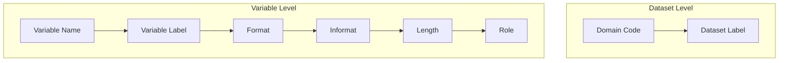

{{#title Metadata - xportrs API}}

# Metadata

xportrs provides rich metadata support for XPT files, ensuring CDISC compliance and data clarity.

## Metadata Overview



## Dataset Metadata

### Domain Code

The domain code is the dataset name (1-8 characters):

```rust,ignore
# use xportrs::{Dataset, Column, ColumnData};
# fn main() -> xportrs::Result<()> {
# let columns = vec![Column::new("A", ColumnData::F64(vec![Some(1.0)]))];
let dataset = Dataset::new("AE", columns)?;

// Access domain code
let code: &str = dataset.domain_code();  // "AE"
# Ok(())
# }
```

### Dataset Label

The dataset label provides a description (0-40 characters):

```rust,ignore
# use xportrs::{Dataset, Column, ColumnData};
# fn main() -> xportrs::Result<()> {
# let columns = vec![Column::new("A", ColumnData::F64(vec![Some(1.0)]))];
// Set at construction
let dataset = Dataset::with_label("AE", "Adverse Events", columns.clone())?;

// Or set later
let mut dataset = Dataset::new("AE", columns)?;
dataset.set_label("Adverse Events");

// Access
let label: Option<&str> = dataset.dataset_label();
# Ok(())
# }
```

## Variable Metadata

### Variable Name

Variable names follow SAS naming rules:

```rust,ignore
# use xportrs::{Column, ColumnData, VariableName};
# fn main() {
# let data = ColumnData::String(vec![Some("001".into())]);
// Name is set at construction
let col = Column::new("USUBJID", data);

// Access name
let name: &str = col.name();

// VariableName type for validation
let var_name = VariableName::new("USUBJID");
assert_eq!(var_name.as_str(), "USUBJID");
# }
```

### Variable Label

Labels describe the variable (0-40 characters):

```rust,ignore
# use xportrs::{Column, ColumnData, Label};
# fn main() {
# let data = ColumnData::String(vec![Some("001".into())]);
let col = Column::new("USUBJID", data)
    .with_label("Unique Subject Identifier");

// Access label
if let Some(label) = col.label() {
    println!("Label: {}", label);
}

// Label type
let label = Label::new("Unique Subject Identifier");
assert_eq!(label.as_str(), "Unique Subject Identifier");
# }
```

### Format

Display formats control how values are shown:

```rust,ignore
# use xportrs::{Column, ColumnData, Format};
# fn main() -> xportrs::Result<()> {
# let data = ColumnData::F64(vec![Some(1.0)]);
// Using Format object
let col = Column::new("AESTDT", data.clone())
    .with_format(Format::parse("DATE9.")?);

// Using format string
let col = Column::new("AESTDT", data)
    .with_format_str("DATE9.")?;

// Access format
if let Some(format) = col.format() {
    println!("Format: {}", format);
}
# Ok(())
# }
```

### Informat

Input formats control how values are read:

```rust,ignore
# use xportrs::{Column, ColumnData, Format};
# fn main() -> xportrs::Result<()> {
# let data = ColumnData::F64(vec![Some(1.0)]);
let col = Column::new("RAWDATE", data)
    .with_informat(Format::parse("DATE9.")?);

if let Some(informat) = col.informat() {
    println!("Informat: {}", informat);
}
# Ok(())
# }
```

### Length

Explicit length for character variables:

```rust,ignore
# use xportrs::{Column, ColumnData};
# fn main() {
// Auto-derived from data
let col = Column::new("VAR", ColumnData::String(vec![
    Some("Hello".into()),  // 5 characters
    Some("World".into()),  // 5 characters
]));
// Length will be 5

// Explicit override
let data = ColumnData::String(vec![Some("text".into())]);
let col = Column::new("VAR", data)
    .with_length(200);  // Force 200 bytes

// Access
if let Some(len) = col.explicit_length() {
    println!("Explicit length: {}", len);
}
# }
```

### Variable Role

Roles categorize variables per CDISC:

```rust,ignore
# use xportrs::{Column, ColumnData, VariableRole};
# fn main() {
# let data = ColumnData::String(vec![Some("001".into())]);
let col = Column::with_role(
    "USUBJID",
    VariableRole::Identifier,
    data,
);

// Available roles
let roles = [
    VariableRole::Identifier,
    VariableRole::Topic,
    VariableRole::Timing,
    VariableRole::Qualifier,
    VariableRole::Rule,
    VariableRole::Synonym,
    VariableRole::Record,
];

// Access role
if let Some(role) = col.role() {
    println!("Role: {:?}", role);
}
# }
```

## Metadata Types

### DomainCode

```rust,ignore
# use xportrs::DomainCode;
# fn main() {
let code = DomainCode::new("AE");

// Access
let s: &str = code.as_str();
let code2 = DomainCode::new("AE");
let owned: String = code2.into_inner();

// Traits
assert_eq!(code, DomainCode::new("AE"));
println!("{}", code);  // "AE"
# }
```

### Label

```rust,ignore
# use xportrs::Label;
# fn main() {
let label = Label::new("Adverse Events");

// Access
let s: &str = label.as_str();
let label2 = Label::new("AE");
let owned: String = label2.into_inner();

// From string
let label: Label = "Test".into();
# }
```

### VariableName

```rust,ignore
# use xportrs::VariableName;
# fn main() {
let name = VariableName::new("USUBJID");

// Access
let s: &str = name.as_str();
let name2 = VariableName::new("TEST");
let owned: String = name2.into_inner();

// Validation (at construction or later)
// Names are uppercased automatically
let name = VariableName::new("usubjid");
assert_eq!(name.as_str(), "USUBJID");
# }
```

## Metadata in XPT Files

### NAMESTR Record Storage

```
Field     Offset  Size  Description
nname     8-15    8     Variable name
nlabel    16-55   40    Variable label
nform     56-63   8     Format name
nfl       64-65   2     Format length
nfd       66-67   2     Format decimals
nfj       68-69   2     Format justification
niform    72-79   8     Informat name
nifl      80-81   2     Informat length
nifd      82-83   2     Informat decimals
```

### Reading Metadata

```rust,ignore
# use xportrs::Xpt;
# fn main() -> xportrs::Result<()> {
let dataset = Xpt::read("ae.xpt")?;

// Dataset metadata
println!("Domain: {}", dataset.domain_code());
if let Some(label) = dataset.dataset_label() {
    println!("Label: {}", label);
}

// Variable metadata
for col in dataset.columns() {
    println!("\n{}", col.name());
    if let Some(label) = col.label() {
        println!("  Label: {}", label);
    }
    if let Some(format) = col.format() {
        println!("  Format: {}", format);
    }
    if let Some(informat) = col.informat() {
        println!("  Informat: {}", informat);
    }
    if let Some(len) = col.explicit_length() {
        println!("  Length: {}", len);
    }
    if let Some(role) = col.role() {
        println!("  Role: {:?}", role);
    }
}
# Ok(())
# }
```

### Preserving Metadata on Roundtrip

```rust,ignore
# use xportrs::Xpt;
# fn main() -> xportrs::Result<()> {
// Read
let original = Xpt::read("ae.xpt")?;

// Modify (metadata preserved)
// ...

// Write
Xpt::writer(original.clone())
    .finalize()?
    .write_path("ae_modified.xpt")?;

// Verify
let reloaded = Xpt::read("ae_modified.xpt")?;
assert_eq!(reloaded.dataset_label(), original.dataset_label());
# Ok(())
# }
```

## Metadata and Define-XML

> [!IMPORTANT]
> Variable labels in XPT files should match those in define.xml. Pinnacle 21 validates this consistency.

```rust,ignore
# use xportrs::{Dataset, Column, ColumnData};
# fn main() -> xportrs::Result<()> {
# let data = ColumnData::String(vec![Some("test".into())]);
// Create dataset with labels matching define.xml
let dataset = Dataset::with_label("AE", "Adverse Events", vec![
    Column::new("STUDYID", data.clone())
        .with_label("Study Identifier"),  // Must match define.xml
    Column::new("USUBJID", data)
        .with_label("Unique Subject Identifier"),  // Must match define.xml
    // ...
])?;
# Ok(())
# }
```

## Best Practices

1. **Always include labels**: Labels help reviewers understand data
2. **Use standard formats**: DATE9., DATETIME20., $CHARn.
3. **Set explicit lengths**: Control character variable lengths
4. **Assign roles**: Categorize variables per CDISC
5. **Verify roundtrip**: Ensure metadata survives read/write cycles

```rust,ignore
# use xportrs::{Column, ColumnData, Format, VariableRole};
// Complete metadata example
let col = Column::with_role(
    "AESTDTC",
    VariableRole::Timing,
    ColumnData::String(vec![Some("2024-01-15".into())]),
)
.with_label("Start Date/Time of Adverse Event")
.with_format(Format::character(19))
.with_length(19);
```
