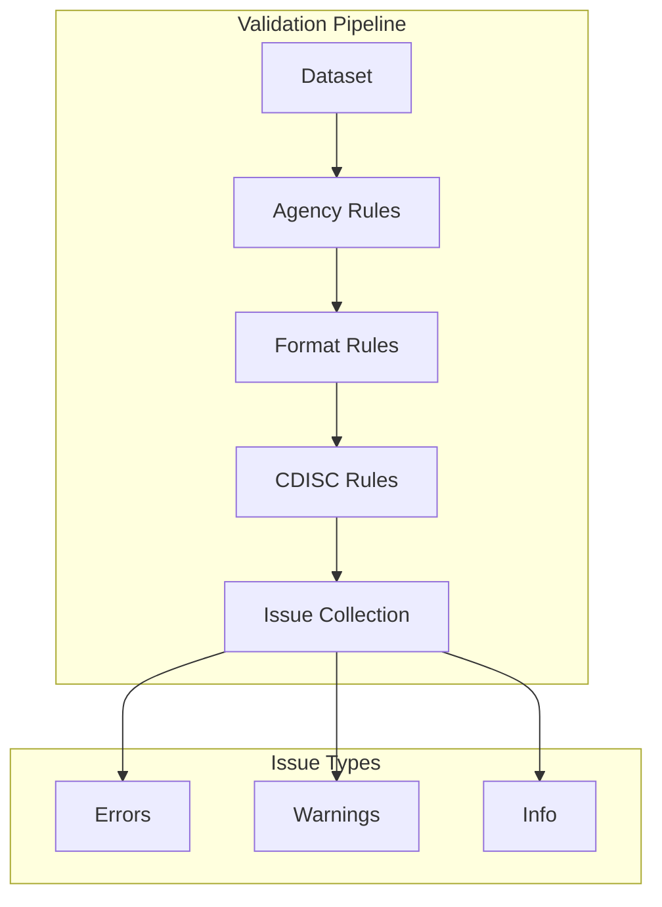

{{#title Validation API - xportrs}}

# Validation API

xportrs provides comprehensive validation for XPT files. This page details the validation API.

## Validation Overview



## ValidatedWrite

The `ValidatedWrite` type represents a validated dataset ready for writing:

```rust,ignore
# use xportrs::{Severity, Xpt, Dataset, Column, ColumnData};
# fn main() -> xportrs::Result<()> {
# let dataset = Dataset::new("AE", vec![Column::new("A", ColumnData::F64(vec![Some(1.0)]))])?;
let validated = Xpt::writer(dataset).finalize()?;

// Check for issues
println!("Has errors: {}", validated.has_errors());
println!("Has warnings: {}", validated.has_warnings());

// Get all issues
let issues = validated.issues();

// Only write if no errors
if !validated.has_errors() {
    validated.write_path("output.xpt")?;
}
# Ok(())
# }
```

## Issue Type

The `Issue` enum represents validation issues:

### Issue Variants

```rust,ignore
# use xportrs::Issue;
# let issue: Issue = todo!();
match issue {
    Issue::VariableNameTooLong { variable, length } => {
        println!("Variable {} name is {} bytes (max 8)", variable, length);
    }
    Issue::VariableLabelTooLong { variable, length } => {
        println!("Variable {} label is {} bytes (max 40)", variable, length);
    }
    Issue::MissingVariableLabel { variable } => {
        println!("Variable {} is missing a label", variable);
    }
    Issue::MissingDatasetLabel { dataset } => {
        println!("Dataset {} is missing a label", dataset);
    }
    Issue::InvalidFormatSyntax { variable, format, reason } => {
        println!("Variable {} has invalid format '{}': {}", variable, format, reason);
    }
    // ... other variants
    _ => {}
}
```

### Issue Properties

```rust,ignore
# use xportrs::{Severity, Issue};
# let issue: Issue = todo!();
// Severity level
let severity: Severity = issue.severity();

// Target (variable name, dataset name, etc.)
let target: &str = issue.target();

// Display representation
println!("{}", issue);

// Debug representation
println!("{:?}", issue);
```

## Severity Levels

```rust,ignore
# use xportrs::Severity;
# let severity = Severity::Error;
match severity {
    Severity::Error => {
        // Blocks file writing
        // File would be rejected by agency
    }
    Severity::Warning => {
        // Does not block writing
        // Review recommended
    }
    Severity::Info => {
        // Informational only
        // Best practice suggestion
    }
}

// Severity is ordered
assert!(Severity::Info < Severity::Warning);
assert!(Severity::Warning < Severity::Error);
```

## Filtering Issues

```rust,ignore
# use xportrs::{Xpt, Dataset, Column, ColumnData, Severity};
# fn main() -> xportrs::Result<()> {
# let dataset = Dataset::new("AE", vec![Column::new("A", ColumnData::F64(vec![Some(1.0)]))])?;
let validated = Xpt::writer(dataset).finalize()?;

// Get only errors
let errors: Vec<_> = validated.issues()
    .iter()
    .filter(|i| i.severity() == Severity::Error)
    .collect();

// Get issues for specific variable
let usubjid_issues: Vec<_> = validated.issues()
    .iter()
    .filter(|i| i.target() == "USUBJID")
    .collect();

// Count by severity
let error_count = validated.issues()
    .iter()
    .filter(|i| i.severity() == Severity::Error)
    .count();
# Ok(())
# }
```

## Agency-Specific Validation

```rust,ignore
# use xportrs::{Agency, Xpt, Dataset, Column, ColumnData};
# fn main() -> xportrs::Result<()> {
# let dataset = Dataset::new("AE", vec![Column::new("A", ColumnData::F64(vec![Some(1.0)]))])?;
// FDA: Strict ASCII validation
let fda_result = Xpt::writer(dataset.clone())
    .agency(Agency::FDA)
    .finalize()?;

// Check for ASCII violations
for issue in fda_result.issues() {
    if format!("{}", issue).contains("ASCII") {
        println!("ASCII issue: {}", issue);
    }
}
# Ok(())
# }
```

## Validation Rules

### Variable Name Rules

| Rule | Severity | Trigger |
|------|----------|---------|
| Empty name | Error | Name is empty string |
| Name too long | Error | Name > 8 bytes |
| Invalid characters | Error | Non-alphanumeric (except _) |
| Starts with number | Error | First char is digit |
| Non-uppercase | Info | Lowercase letters present |

### Variable Label Rules

| Rule | Severity | Trigger |
|------|----------|---------|
| Missing label | Warning | Label is None or empty |
| Label too long | Error | Label > 40 bytes |
| Non-ASCII (FDA) | Error | Non-ASCII characters |

### Dataset Rules

| Rule | Severity | Trigger |
|------|----------|---------|
| Empty name | Error | Domain code is empty |
| Name too long | Error | Domain code > 8 bytes |
| Missing label | Warning | Dataset label is None |
| Label too long | Error | Label > 40 bytes |

### Data Rules

| Rule | Severity | Trigger |
|------|----------|---------|
| Column length mismatch | Error | Columns have different lengths |
| Character too long | Error | Character value > 200 bytes |

## Custom Pre-Validation

Add custom validation before xportrs validation:

```rust,ignore
use xportrs::{Dataset, Xpt};

fn custom_validate(dataset: &Dataset) -> Result<(), String> {
    // Check for required variables
    let required = ["STUDYID", "USUBJID"];
    for var in required {
        if dataset.column(var).is_none() {
            return Err(format!("Missing required variable: {}", var));
        }
    }

    // Check STUDYID consistency
    // ... additional checks ...

    Ok(())
}

fn write_with_validation(dataset: Dataset, path: &str) -> xportrs::Result<()> {
    // Custom validation first
    custom_validate(&dataset)
        .map_err(|e| xportrs::Error::invalid_data(e))?;

    // Then xportrs validation
    let validated = Xpt::writer(dataset).finalize()?;

    if validated.has_errors() {
        return Err(xportrs::Error::invalid_data("Validation failed"));
    }

    validated.write_path(path)?;
    Ok(())
}
```

## Validation Reporting

```rust,ignore
use xportrs::{Severity, Xpt};

fn report_validation(dataset: xportrs::Dataset) {
    let validated = Xpt::writer(dataset).finalize().unwrap();

    // Summary
    let errors = validated.issues().iter()
        .filter(|i| i.severity() == Severity::Error).count();
    let warnings = validated.issues().iter()
        .filter(|i| i.severity() == Severity::Warning).count();
    let infos = validated.issues().iter()
        .filter(|i| i.severity() == Severity::Info).count();

    println!("Validation Summary:");
    println!("  Errors:   {}", errors);
    println!("  Warnings: {}", warnings);
    println!("  Info:     {}", infos);

    // Detailed report
    if !validated.issues().is_empty() {
        println!("\nDetails:");
        for issue in validated.issues() {
            let prefix = match issue.severity() {
                Severity::Error => "ERROR",
                Severity::Warning => "WARN ",
                Severity::Info => "INFO ",
            };
            println!("  [{}] {} - {}", prefix, issue.target(), issue);
        }
    }
}
```

## Integration with Pinnacle 21

> [!NOTE]
> xportrs validation covers XPT-level rules. For complete CDISC validation, use Pinnacle 21 or similar tools.

| Validation Area | xportrs | Pinnacle 21 |
|-----------------|---------|-------------|
| Variable names | ✅ | ✅ |
| Variable labels | ✅ | ✅ |
| Format metadata | ✅ | ✅ |
| Controlled terminology | ❌ | ✅ |
| Required variables | ❌ | ✅ |
| Cross-dataset consistency | ❌ | ✅ |
| define.xml matching | ❌ | ✅ |

## Best Practices

1. **Validate early**: Check validation before processing large datasets
2. **Log all issues**: Keep records of validation results
3. **Fail on errors**: Don't write files with validation errors
4. **Review warnings**: Warnings may indicate data quality issues
5. **Document exceptions**: If shipping with warnings, document why
