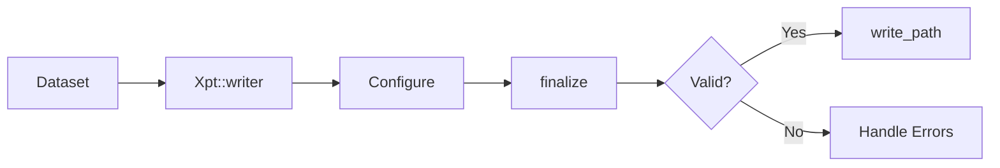

# Writing XPT Files

xportrs provides a builder API for writing XPT files with validation.

## Basic Writing

The simplest way to write an XPT file:

```rust
use xportrs::{Column, ColumnData, Dataset, Xpt};

let dataset = Dataset::new("AE", vec![
    Column::new("USUBJID", ColumnData::String(vec![Some("001".into())])),
    Column::new("AESEQ", ColumnData::F64(vec![Some(1.0)])),
])?;

Xpt::writer(dataset)
    .finalize()?
    .write_path("ae.xpt")?;
```

## Writer Builder

The writer builder provides options for validation and output:

```rust
use xportrs::{Agency, Dataset, Xpt};

let validated = Xpt::writer(dataset)
    .agency(Agency::FDA)           // Agency-specific validation
    .finalize()?;                  // Validate and prepare

// Check validation results
if validated.has_errors() {
    for issue in validated.issues() {
        eprintln!("{}", issue);
    }
    return Err("Validation failed".into());
}

// Write if valid
validated.write_path("output.xpt")?;
```

## Validation Workflow



### Checking Issues

```rust
use xportrs::{Severity, Xpt};

let validated = Xpt::writer(dataset).finalize()?;

// Check for any issues
println!("Has errors: {}", validated.has_errors());
println!("Has warnings: {}", validated.has_warnings());

// Get all issues
for issue in validated.issues() {
    match issue.severity() {
        Severity::Error => eprintln!("ERROR: {}", issue),
        Severity::Warning => eprintln!("WARNING: {}", issue),
        Severity::Info => println!("INFO: {}", issue),
    }
}
```

## Agency Validation

Different agencies have different requirements:

```rust
use xportrs::{Agency, Xpt};

// FDA (strict ASCII)
let fda_result = Xpt::writer(dataset.clone())
    .agency(Agency::FDA)
    .finalize()?;

// PMDA (allows extended characters)
let pmda_result = Xpt::writer(dataset.clone())
    .agency(Agency::PMDA)
    .finalize()?;

// NMPA
let nmpa_result = Xpt::writer(dataset)
    .agency(Agency::NMPA)
    .finalize()?;
```

## Writing to Different Destinations

### Write to File Path

```rust
validated.write_path("output.xpt")?;
```

### Write to Buffer

```rust
let mut buffer = Vec::new();
validated.write_to(&mut buffer)?;

// buffer now contains the XPT bytes
println!("Wrote {} bytes", buffer.len());
```

### Write to Any Writer

```rust
use std::fs::File;
use std::io::BufWriter;

let file = File::create("output.xpt")?;
let mut writer = BufWriter::new(file);
validated.write_to(&mut writer)?;
```

## File Splitting

Large datasets are automatically split:

```rust
use xportrs::Xpt;

let paths = Xpt::writer(large_dataset)
    .max_file_size_gb(5.0)  // Default is 5.0
    .finalize()?
    .write_path("ae.xpt")?;  // May create ae_001.xpt, ae_002.xpt, etc.

for path in paths {
    println!("Wrote: {}", path.display());
}
```

## Complete Example

```rust
use xportrs::{Agency, Column, ColumnData, Dataset, Format, Xpt};

fn write_adverse_events() -> xportrs::Result<()> {
    // Create dataset with full metadata
    let dataset = Dataset::with_label("AE", "Adverse Events", vec![
        Column::new("STUDYID", ColumnData::String(vec![
            Some("ABC-123".into()),
            Some("ABC-123".into()),
        ]))
        .with_label("Study Identifier")
        .with_format(Format::character(20)),

        Column::new("USUBJID", ColumnData::String(vec![
            Some("ABC-123-001".into()),
            Some("ABC-123-002".into()),
        ]))
        .with_label("Unique Subject Identifier")
        .with_format(Format::character(40)),

        Column::new("AESEQ", ColumnData::F64(vec![
            Some(1.0),
            Some(1.0),
        ]))
        .with_label("Sequence Number")
        .with_format(Format::numeric(8, 0)),

        Column::new("AETERM", ColumnData::String(vec![
            Some("HEADACHE".into()),
            Some("NAUSEA".into()),
        ]))
        .with_label("Reported Term for the Adverse Event")
        .with_format(Format::character(200))
        .with_length(200),

        Column::new("AESTDTC", ColumnData::String(vec![
            Some("2024-01-15".into()),
            Some("2024-01-16".into()),
        ]))
        .with_label("Start Date/Time of Adverse Event")
        .with_format(Format::character(19))
        .with_length(19),
    ])?;

    // Validate with FDA rules
    let validated = Xpt::writer(dataset)
        .agency(Agency::FDA)
        .finalize()?;

    // Report validation issues
    if validated.has_warnings() {
        println!("Warnings:");
        for issue in validated.issues() {
            if issue.severity() == xportrs::Severity::Warning {
                println!("  - {}", issue);
            }
        }
    }

    if validated.has_errors() {
        eprintln!("Cannot write due to errors:");
        for issue in validated.issues() {
            if issue.severity() == xportrs::Severity::Error {
                eprintln!("  - {}", issue);
            }
        }
        return Err(xportrs::Error::invalid_data("Validation failed"));
    }

    // Write the file
    validated.write_path("ae.xpt")?;
    println!("Successfully wrote ae.xpt");

    Ok(())
}
```

## Error Handling

```rust
use xportrs::{Error, Xpt};

let result = Xpt::writer(dataset)
    .finalize()
    .and_then(|v| v.write_path("output.xpt"));

match result {
    Ok(paths) => {
        for path in paths {
            println!("Wrote: {}", path.display());
        }
    }
    Err(Error::Io(e)) => eprintln!("IO error: {}", e),
    Err(Error::InvalidSchema { message }) => {
        eprintln!("Schema error: {}", message);
    }
    Err(e) => eprintln!("Error: {}", e),
}
```

## Best Practices

> [!TIP]
> Always check validation results before deploying files to production or submission.

1. **Add metadata**: Include labels and formats for all variables
2. **Use agency validation**: Specify the target agency for appropriate checks
3. **Handle warnings**: Review warnings even if they don't block writing
4. **Test roundtrip**: Verify files can be read back correctly
5. **Check file size**: Ensure files don't exceed agency limits

```rust
// Production-ready writing pattern
fn write_submission_file(dataset: Dataset, path: &str) -> xportrs::Result<()> {
    let validated = Xpt::writer(dataset)
        .agency(Agency::FDA)
        .finalize()?;

    // Log all issues
    for issue in validated.issues() {
        log::info!("{}: {}", issue.severity(), issue);
    }

    // Fail on errors
    if validated.has_errors() {
        return Err(Error::invalid_data("Validation errors present"));
    }

    // Write and verify
    let paths = validated.write_path(path)?;
    
    // Verify by reading back
    for path in &paths {
        let _ = Xpt::read(path)?;
    }

    Ok(())
}
```
