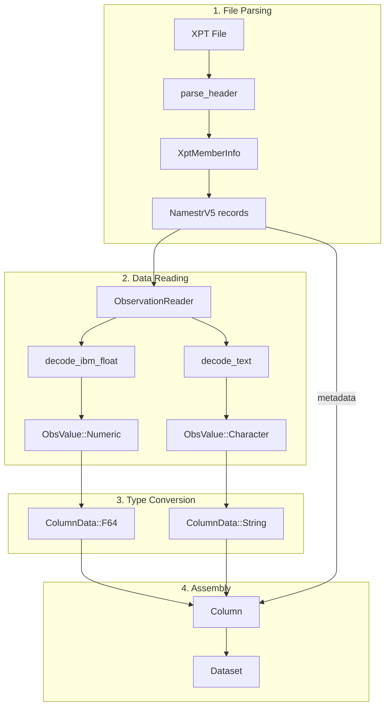
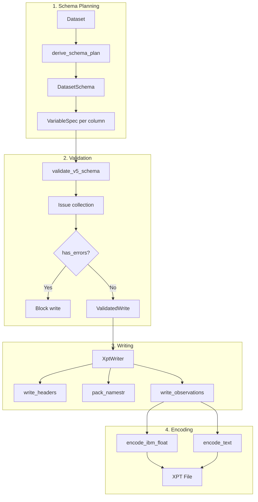
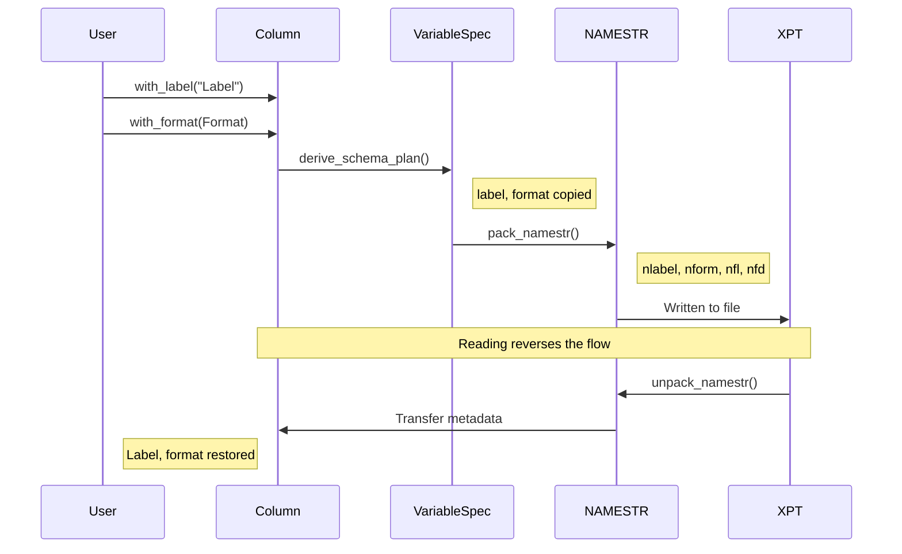
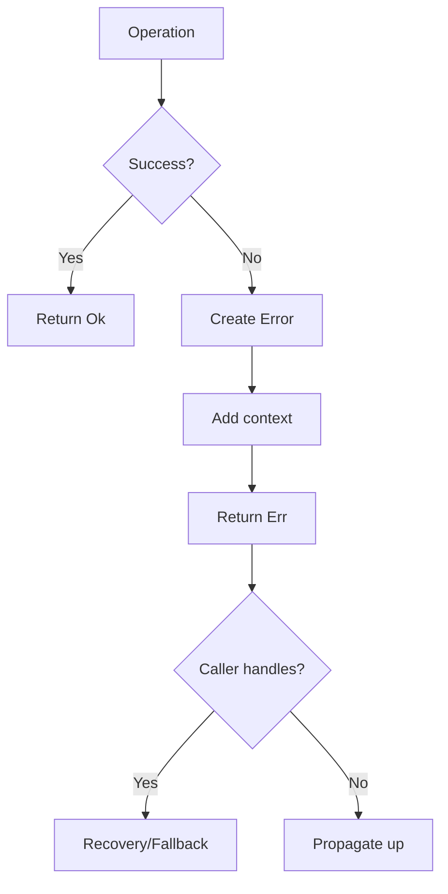

# Data Flow

This page details how data flows through xportrs during reading and writing.

## Reading Flow



### Step-by-Step Reading

#### 1. Parse File Header

```rust
// In parse.rs
pub fn parse_header<R: Read + Seek>(reader: &mut R) -> Result<XptInfo> {
    // Read library header (80 bytes)
    let lib_header = read_record(reader)?;
    verify_library_header(&lib_header)?;
    
    // Read each member
    let mut members = Vec::new();
    while let Some(member) = parse_member_header(reader)? {
        members.push(member);
    }
    
    Ok(XptInfo { members, ... })
}
```

#### 2. Parse NAMESTR Records

```rust
// In namestr.rs
pub fn unpack_namestr(bytes: &[u8; 140]) -> Result<NamestrV5> {
    let ntype = i16::from_be_bytes([bytes[0], bytes[1]]);
    let nlng = i16::from_be_bytes([bytes[4], bytes[5]]);
    let nname = parse_string(&bytes[8..16]);
    let nlabel = parse_string(&bytes[16..56]);
    let nform = parse_string(&bytes[56..64]);
    let nfl = i16::from_be_bytes([bytes[64], bytes[65]]);
    // ... more fields
    
    Ok(NamestrV5 { ntype, nlng, nname, nlabel, ... })
}
```

#### 3. Read Observations

```rust
// In obs.rs
pub fn read_observation(&mut self) -> Result<Option<Vec<ObsValue>>> {
    let mut row = Vec::with_capacity(self.variables.len());
    
    for var in &self.variables {
        if var.is_numeric() {
            let bytes = self.read_bytes(8)?;
            let value = decode_ibm_float(bytes);
            row.push(ObsValue::Numeric(value));
        } else {
            let bytes = self.read_bytes(var.length)?;
            let value = decode_text(bytes);
            row.push(ObsValue::Character(value));
        }
    }
    
    Ok(Some(row))
}
```

#### 4. Build Column with Metadata

```rust
// In reader.rs
let cols: Vec<Column> = member.variables.iter()
    .zip(columns)
    .map(|(var, data)| {
        let mut col = Column::new(&var.nname, data);
        
        // Transfer metadata from NAMESTR
        if !var.nlabel.is_empty() {
            col = col.with_label(var.nlabel.as_str());
        }
        if !var.nform.is_empty() {
            col = col.with_format(Format::from_namestr(
                &var.nform, var.nfl, var.nfd, var.nfj
            ));
        }
        if var.is_character() {
            col = col.with_length(var.length());
        }
        
        col
    })
    .collect();
```

## Writing Flow



### Step-by-Step Writing

#### 1. Derive Schema

```rust
// In derive.rs
pub fn derive_schema_plan(
    dataset: &Dataset,
    metadata: Option<&VariableMetadata>,
) -> DatasetSchema {
    let variables: Vec<VariableSpec> = dataset.columns()
        .iter()
        .enumerate()
        .map(|(i, col)| {
            let mut spec = VariableSpec {
                name: col.name().to_uppercase(),
                is_numeric: col.data().is_numeric(),
                length: compute_length(col),
                position: 0,  // Computed later
                ...
            };
            
            // Apply Column metadata
            if let Some(label) = col.label() {
                spec.label = label.to_string();
            }
            if let Some(format) = col.format() {
                spec.format = Some(format.clone());
            }
            
            spec
        })
        .collect();
    
    DatasetSchema { variables, ... }
}
```

#### 2. Validate

```rust
// In checks_v5.rs
pub fn validate_v5_schema(
    schema: &DatasetSchema,
    options: &WriteOptions,
) -> Vec<Issue> {
    let mut issues = Vec::new();
    
    // Dataset-level checks
    if schema.dataset_label.is_empty() {
        issues.push(Issue::MissingDatasetLabel { 
            dataset: schema.name.clone() 
        });
    }
    
    // Variable-level checks
    for var in &schema.variables {
        if var.name.len() > 8 {
            issues.push(Issue::VariableNameTooLong { ... });
        }
        if var.label.is_empty() {
            issues.push(Issue::MissingVariableLabel { 
                variable: var.name.clone() 
            });
        }
        // ... more checks
    }
    
    issues
}
```

#### 3. Pack NAMESTR

```rust
// In namestr.rs
pub fn pack_namestr<W: Write>(
    writer: &mut W,
    var: &VariableSpec,
    position: i32,
) -> Result<()> {
    // ntype
    writer.write_i16::<BigEndian>(
        if var.is_numeric { 1 } else { 2 }
    )?;
    
    // nhfun (always 0)
    writer.write_i16::<BigEndian>(0)?;
    
    // nlng
    writer.write_i16::<BigEndian>(var.length as i16)?;
    
    // nvar0
    writer.write_i16::<BigEndian>(var.index as i16 + 1)?;
    
    // nname (8 bytes, space-padded)
    let mut name = [b' '; 8];
    name[..var.name.len().min(8)]
        .copy_from_slice(var.name.as_bytes());
    writer.write_all(&name)?;
    
    // nlabel (40 bytes, space-padded)
    let mut label = [b' '; 40];
    label[..var.label.len().min(40)]
        .copy_from_slice(var.label.as_bytes());
    writer.write_all(&label)?;
    
    // Format fields
    if let Some(ref format) = var.format {
        write_format_fields(writer, format)?;
    } else {
        write_empty_format_fields(writer)?;
    }
    
    // ... remaining fields
    
    Ok(())
}
```

#### 4. Write Observations

```rust
// In writer.rs
fn write_observations<W: Write>(
    writer: &mut W,
    dataset: &Dataset,
    schema: &DatasetSchema,
) -> Result<()> {
    for row_idx in 0..dataset.nrows() {
        for (col, spec) in dataset.columns().iter()
            .zip(&schema.variables) 
        {
            if spec.is_numeric {
                let value = get_numeric_value(col, row_idx);
                let ibm = encode_ibm_float(value);
                writer.write_all(&ibm)?;
            } else {
                let value = get_string_value(col, row_idx);
                let padded = pad_to_length(&value, spec.length);
                writer.write_all(&padded)?;
            }
        }
    }
    
    // Pad to 80-byte boundary
    pad_to_record_boundary(writer)?;
    
    Ok(())
}
```

## Metadata Flow



## Error Flow



All errors are:
- Enriched with context
- `Send + Sync + 'static`
- Implement `std::error::Error`
