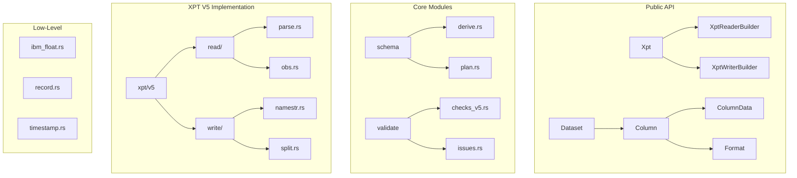
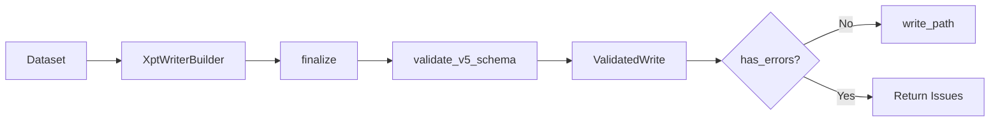
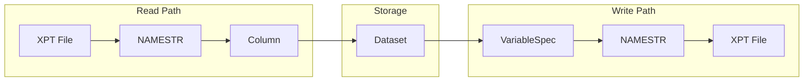

# Architecture Overview

This page provides a high-level view of xportrs internal architecture.

## Module Structure



## Key Components

### Public API Layer

| Component | Purpose |
|-----------|---------|
| `Xpt` | Entry point for reading/writing |
| `Dataset` | Collection of columns with metadata |
| `Column` | Variable data and metadata |
| `ColumnData` | Typed data storage |
| `Format` | SAS format parsing and representation |

### Schema Layer

| Component | Purpose |
|-----------|---------|
| `DatasetSchema` | Computed schema for writing |
| `VariableSpec` | Per-variable write plan |
| `derive_schema_plan()` | Computes schema from Dataset |

### Validation Layer

| Component | Purpose |
|-----------|---------|
| `ValidatedWrite` | Validated dataset ready to write |
| `Issue` | Validation problem description |
| `Severity` | Error/Warning/Info classification |

### XPT V5 Layer

| Component | Purpose |
|-----------|---------|
| `XptReader` | Reads XPT files |
| `XptWriter` | Writes XPT files |
| `SplitWriter` | Handles file splitting |
| `pack_namestr()` | Creates NAMESTR records |

### Low-Level Layer

| Component | Purpose |
|-----------|---------|
| `ibm_float` | IBM float encoding/decoding |
| `record` | 80-byte record handling |
| `timestamp` | SAS epoch date handling |

## Design Principles

### 1. Type Safety

Rust's type system prevents common errors:

```rust
// DomainCode, Label, VariableName are distinct types
let domain = DomainCode::new("AE");
let label = Label::new("Adverse Events");
// Can't accidentally swap them

// ColumnData enforces type consistency
let data = ColumnData::F64(vec![Some(1.0)]);
// Can't mix types within a column
```

### 2. Builder Pattern

Complex objects use builders for ergonomic construction:

```rust
// Reader builder
let dataset = Xpt::reader("file.xpt")
    .row_limit(100)
    .read()?;

// Writer builder
let validated = Xpt::writer(dataset)
    .agency(Agency::FDA)
    .finalize()?;
```

### 3. Validation Pipeline

Validation happens before writing:



### 4. Metadata Preservation

Metadata flows through all operations:



### 5. Zero-Copy Where Possible

String data uses references where safe:

```rust
// Reading: borrows from buffer where possible
// Writing: uses slices directly when aligned
```

## Error Handling

xportrs uses a unified `Error` type:

```rust
pub enum Error {
    Io(std::io::Error),
    InvalidHeader { message: String },
    InvalidData { message: String },
    InvalidSchema { message: String },
    MemberNotFound { domain_code: String },
    // ...
}
```

Errors implement `std::error::Error` and are `Send + Sync + 'static`.

## Thread Safety

All public types are `Send + Sync`:

```rust
// Can be shared across threads
let dataset = Arc::new(Xpt::read("data.xpt")?);

// Can be sent to other threads
std::thread::spawn(move || {
    for col in dataset.columns() {
        println!("{}", col.name());
    }
});
```

## Memory Layout

### Dataset

```
Dataset {
    domain_code: DomainCode(String),
    dataset_label: Option<Label>,
    columns: Vec<Column>,
}
```

### Column

```
Column {
    name: VariableName(String),
    role: Option<VariableRole>,
    data: ColumnData,
    label: Option<Label>,
    format: Option<Format>,
    informat: Option<Format>,
    length: Option<usize>,
}
```

### ColumnData

```
enum ColumnData {
    F64(Vec<Option<f64>>),
    I64(Vec<Option<i64>>),
    Bool(Vec<Option<bool>>),
    String(Vec<Option<String>>),
    Bytes(Vec<Option<Vec<u8>>>),
    Date(Vec<Option<NaiveDate>>),
    DateTime(Vec<Option<NaiveDateTime>>),
    Time(Vec<Option<NaiveTime>>),
}
```

## Extension Points

### Adding New Validation Rules

1. Add variant to `Issue` enum
2. Implement `severity()` and `Display`
3. Add check in `validate_v5_schema()`

### Supporting New Agencies

1. Add variant to `Agency` enum
2. Add agency-specific validation in `checks_v5.rs`

### Adding Column Types

1. Add variant to `ColumnData`
2. Handle in reader/writer
3. Add `From` implementation
