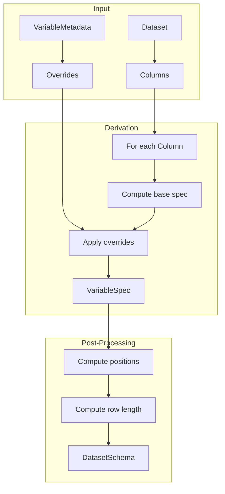
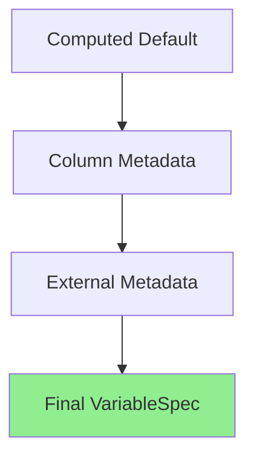

# Schema Derivation

This page explains how xportrs derives the write schema from a Dataset.

## Schema Overview

The schema contains all information needed to write an XPT file:

```rust
pub struct DatasetSchema {
    pub name: String,           // Dataset name (uppercase)
    pub label: String,          // Dataset label
    pub variables: Vec<VariableSpec>,
    pub row_length: usize,      // Bytes per observation row
}

pub struct VariableSpec {
    pub name: String,           // Variable name
    pub label: String,          // Variable label
    pub is_numeric: bool,       // Type flag
    pub length: usize,          // Bytes per value
    pub position: usize,        // Offset in row
    pub format: Option<Format>, // Display format
    pub informat: Option<Format>, // Input format
}
```

## Derivation Process



## Step 1: Compute Base Spec

For each column, derive the base specification:

```rust
fn compute_base_spec(col: &Column, index: usize) -> VariableSpec {
    // Determine type
    let is_numeric = matches!(col.data(), 
        ColumnData::F64(_) | ColumnData::I64(_) | ColumnData::Bool(_) |
        ColumnData::Date(_) | ColumnData::DateTime(_) | ColumnData::Time(_)
    );
    
    // Compute length
    let length = if is_numeric {
        8  // Always 8 bytes for numerics
    } else {
        compute_character_length(col)
    };
    
    VariableSpec {
        name: col.name().to_uppercase(),
        label: String::new(),
        is_numeric,
        length,
        position: 0,
        format: None,
        informat: None,
    }
}
```

## Step 2: Character Length Computation

Character length is computed from data unless explicitly set:

```rust
fn compute_character_length(col: &Column) -> usize {
    // Priority 1: Explicit length override
    if let Some(len) = col.explicit_length() {
        return len.min(200);  // Cap at 200
    }
    
    // Priority 2: Derive from data
    if let ColumnData::String(values) = col.data() {
        let max_len = values.iter()
            .filter_map(|v| v.as_ref())
            .map(|s| s.len())
            .max()
            .unwrap_or(1);
        
        // Round up to reasonable size, cap at 200
        max_len.max(1).min(200)
    } else if let ColumnData::Bytes(values) = col.data() {
        let max_len = values.iter()
            .filter_map(|v| v.as_ref())
            .map(|b| b.len())
            .max()
            .unwrap_or(1);
        
        max_len.max(1).min(200)
    } else {
        8  // Default for numeric types
    }
}
```

## Step 3: Apply Column Metadata

Column metadata is applied to the spec:

```rust
fn apply_column_metadata(spec: &mut VariableSpec, col: &Column) {
    // Label from Column
    if let Some(label) = col.label() {
        spec.label = truncate_to_bytes(label.as_ref(), 40);
    }
    
    // Format from Column
    if let Some(format) = col.format() {
        spec.format = Some(format.clone());
    }
    
    // Informat from Column
    if let Some(informat) = col.informat() {
        spec.informat = Some(informat.clone());
    }
    
    // Length override from Column (for character)
    if !spec.is_numeric {
        if let Some(len) = col.explicit_length() {
            spec.length = len.min(200);
        }
    }
}
```

## Step 4: Apply External Metadata

Optional external metadata can override Column values:

```rust
fn apply_external_metadata(
    spec: &mut VariableSpec, 
    meta: Option<&VariableMetadata>,
) {
    if let Some(meta) = meta {
        // External metadata takes priority
        if let Some(label) = &meta.label {
            spec.label = truncate_to_bytes(label, 40);
        }
        if let Some(format) = &meta.format {
            spec.format = Some(format.clone());
        }
        if let Some(length) = meta.length {
            if !spec.is_numeric {
                spec.length = length.min(200);
            }
        }
    }
}
```

## Step 5: Compute Positions

After all specs are created, compute byte positions:

```rust
fn compute_positions(specs: &mut [VariableSpec]) {
    let mut position = 0;
    
    for spec in specs {
        spec.position = position;
        position += spec.length;
    }
}

fn compute_row_length(specs: &[VariableSpec]) -> usize {
    specs.iter().map(|s| s.length).sum()
}
```

## Complete Flow

```rust
pub fn derive_schema_plan(
    dataset: &Dataset,
    metadata: Option<&VariableMetadata>,
) -> DatasetSchema {
    // 1. Derive base specs
    let mut variables: Vec<VariableSpec> = dataset.columns()
        .iter()
        .enumerate()
        .map(|(i, col)| compute_base_spec(col, i))
        .collect();
    
    // 2. Apply Column metadata
    for (spec, col) in variables.iter_mut()
        .zip(dataset.columns()) 
    {
        apply_column_metadata(spec, col);
    }
    
    // 3. Apply external metadata
    for spec in &mut variables {
        apply_external_metadata(spec, metadata);
    }
    
    // 4. Compute positions
    compute_positions(&mut variables);
    
    // 5. Build schema
    DatasetSchema {
        name: dataset.domain_code().to_uppercase(),
        label: dataset.dataset_label()
            .map(|l| truncate_to_bytes(l, 40))
            .unwrap_or_default(),
        row_length: compute_row_length(&variables),
        variables,
    }
}
```

## Priority Order

Metadata is applied with this priority (highest to lowest):

1. **External VariableMetadata** - Programmatic overrides
2. **Column metadata** - `.with_label()`, `.with_format()`, etc.
3. **Computed defaults** - Derived from data



## Validation

The schema is validated after derivation:

```rust
fn validate_schema(schema: &DatasetSchema) -> Vec<Issue> {
    let mut issues = Vec::new();
    
    for var in &schema.variables {
        // Name validation
        if var.name.is_empty() {
            issues.push(Issue::InvalidVariableName { ... });
        }
        if var.name.len() > 8 {
            issues.push(Issue::VariableNameTooLong { ... });
        }
        
        // Label validation
        if var.label.is_empty() {
            issues.push(Issue::MissingVariableLabel { ... });
        }
        
        // Length validation
        if !var.is_numeric && var.length > 200 {
            issues.push(Issue::CharacterTooLong { ... });
        }
    }
    
    issues
}
```

## Example

```rust
// Input
let col = Column::new("USUBJID", ColumnData::String(vec![
    Some("ABC-001".into()),
    Some("ABC-002".into()),
]))
.with_label("Unique Subject Identifier")
.with_format(Format::character(40))
.with_length(40);

// Derived VariableSpec
VariableSpec {
    name: "USUBJID",
    label: "Unique Subject Identifier",
    is_numeric: false,
    length: 40,
    position: 0,
    format: Some(Format::character(40)),
    informat: None,
}
```
