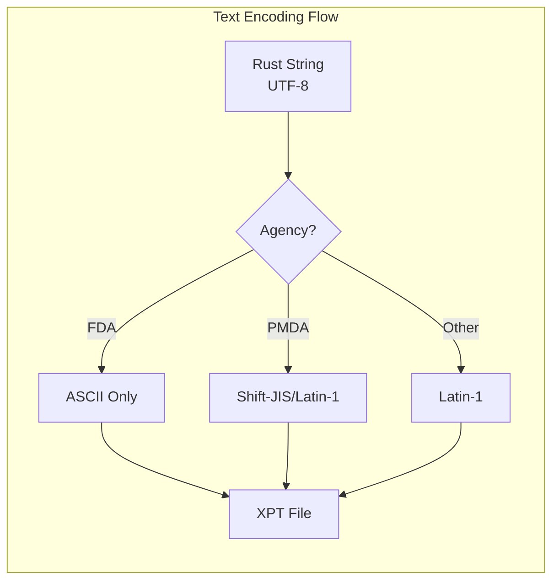
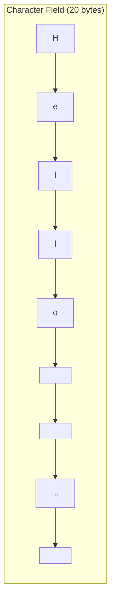

# Text Encoding

XPT files store text as fixed-width byte strings. This page covers character encoding considerations.

## Encoding Overview



## Supported Encodings

| Encoding             | xportrs Support | Use Case            |
|----------------------|-----------------|---------------------|
| ASCII                | Full            | FDA submissions     |
| Latin-1 (ISO-8859-1) | Full            | Extended European   |
| UTF-8                | Input only      | Converted to target |

## FDA ASCII Requirements

For FDA submissions, all text must be ASCII (bytes 0x00-0x7F):

```rust
use xportrs::{Agency, Xpt};

// ASCII validation is automatic with FDA agency
let validated = Xpt::writer(dataset)
.agency(Agency::FDA)
.finalize() ?;

// Non-ASCII characters will generate errors
for issue in validated.issues() {
println ! ("{}", issue);
}
```

### Valid ASCII Characters

| Category    | Characters                        |
|-------------|-----------------------------------|
| Letters     | A-Z, a-z                          |
| Digits      | 0-9                               |
| Punctuation | `!\"#$%&'()*+,-./:;<=>?@[\\]^_\`{ |}~` |
| Space       | ` ` (0x20)                        |

### Common Non-ASCII Issues

| Character          | Unicode  | Issue     |
|--------------------|----------|-----------|
| é (e-acute)        | U+00E9   | Not ASCII |
| ° (degree)         | U+00B0   | Not ASCII |
| µ (micro)          | U+00B5   | Not ASCII |
| ® (registered)     | U+00AE   | Not ASCII |
| — (em dash)        | U+2014   | Not ASCII |
| " " (smart quotes) | U+201C/D | Not ASCII |

### Handling Non-ASCII in FDA Submissions

```rust
/// Replace common non-ASCII characters with ASCII equivalents
fn ascii_safe(s: &str) -> String {
    s.chars().map(|c| match c {
        'é' | 'è' | 'ê' | 'ë' => 'e',
        'á' | 'à' | 'â' | 'ä' => 'a',
        'ó' | 'ò' | 'ô' | 'ö' => 'o',
        'ú' | 'ù' | 'û' | 'ü' => 'u',
        'í' | 'ì' | 'î' | 'ï' => 'i',
        'ñ' => 'n',
        'ç' => 'c',
        '°' => ' ',  // or "deg"
        'µ' => 'u',  // or "micro"
        '®' => '(
        R)',
            '™' => '(TM)',
            '"' | '"' => '"',
        ''' | ''
        ' => '\'',
        '—' | '–' => '-',
        c if c.is_ascii() => c,
        _ => '?',  // Unknown non-ASCII
    }).collect()
}
```

## Latin-1 Encoding

For non-FDA submissions, Latin-1 (ISO-8859-1) provides extended character support:

```rust
use xportrs::{TextMode, Xpt};

let validated = Xpt::writer(dataset)
.text_mode(TextMode::Latin1)
.finalize() ?;
```

### Latin-1 Character Range

| Range     | Description                       |
|-----------|-----------------------------------|
| 0x00-0x7F | ASCII (same as UTF-8)             |
| 0x80-0x9F | Control characters (avoid)        |
| 0xA0-0xFF | Extended Latin (accents, symbols) |

## Character Variable Length

XPT character variables have a fixed length (1-200 bytes):



- Values shorter than the field length are **right-padded with spaces**
- Values longer than the field length are **truncated**

### Explicit Length Control

```rust
use xportrs::{Column, ColumnData, Format};

// Set explicit length to 200 bytes for long text
Column::new("AETERM", ColumnData::String(vec![Some("Headache".into())]))
.with_label("Reported Term")
.with_format(Format::character(200))
.with_length(200)
```

### Auto-Derived Length

When no explicit length is set, xportrs derives the length from the data:

```rust
// Length will be max(len("Hello"), len("World")) = 5
let data = vec![Some("Hello".into()), Some("World".into())];
Column::new("VAR", ColumnData::String(data))
```

## UTF-8 to Encoding Conversion

xportrs accepts UTF-8 strings and converts to the target encoding:

```rust
// UTF-8 input (Rust default)
let utf8_string = "Héllo Wörld";  // Contains non-ASCII

// With ASCII mode (FDA)
// Error: contains non-ASCII characters

// With Latin-1 mode
// Converted: "Héllo Wörld" → Latin-1 bytes
```

### Conversion Errors

Non-representable characters cause errors:

```rust
// Japanese text cannot be represented in Latin-1
let japanese = "日本語";

// This will fail with Latin-1 encoding
// Use ASCII transliteration or Shift-JIS for PMDA
```

## Space Padding

XPT uses space (0x20) for padding, not null (0x00):

```rust
fn pad_to_length(s: &str, len: usize) -> Vec<u8> {
    let mut bytes = s.as_bytes().to_vec();
    bytes.resize(len, b' ');  // Space padding
    bytes
}

// "Hi" with length 8 → [72, 105, 32, 32, 32, 32, 32, 32]
//                        'H' 'i'  ' '  ' '  ' '  ' '  ' '  ' '
```

## Reading Encoded Text

When reading XPT files, xportrs trims trailing spaces and converts to UTF-8:

```rust
use xportrs::Xpt;

let dataset = Xpt::read("data.xpt") ?;

for col in dataset.columns() {
if let ColumnData::String(values) = col.data() {
for value in values {
if let Some(s) = value {
// s is a Rust String (UTF-8)
println ! ("{}", s);
}
}
}
}
```

## Best Practices

1. **Use ASCII for FDA submissions**: Avoid accented characters and symbols
2. **Validate early**: Check for encoding issues before building datasets
3. **Document character sets**: Note any extended character usage in metadata
4. **Prefer explicit lengths**: Set character lengths explicitly for predictable behavior
5. **Test roundtrip**: Verify that read → write → read preserves text correctly

> [!IMPORTANT]
> The FDA Technical Conformance Guide requires ASCII text. Non-ASCII characters may cause validation failures or data integrity issues during regulatory review.
