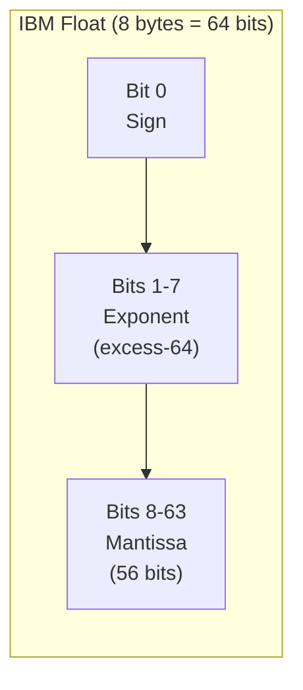

# IBM Floating Point

XPT files use **IBM System/360 floating-point** format, not IEEE 754. This page explains the format and conversion process.

## Format Overview

IBM floating-point uses **base-16** (hexadecimal) exponent instead of base-2:



| Field    | Bits | Range | Description               |
|----------|------|-------|---------------------------|
| Sign     | 1    | 0-1   | 0=positive, 1=negative    |
| Exponent | 7    | 0-127 | Power of 16, biased by 64 |
| Mantissa | 56   | —     | Fractional part in hex    |

## Key Differences from IEEE 754

| Aspect         | IEEE 754 (double) | IBM Float      |
|----------------|-------------------|----------------|
| Exponent base  | 2                 | 16             |
| Exponent bias  | 1023              | 64             |
| Mantissa bits  | 52                | 56             |
| Implied bit    | Yes (1.xxx)       | No             |
| Precision      | ~15-17 digits     | ~14-16 digits  |
| Special values | NaN, ±Inf         | Missing values |

## Value Calculation

The value of an IBM float is:

```
value = sign × (0.mantissa) × 16^(exponent - 64)
```

Where:

- `sign` = +1 if bit 0 is 0, -1 if bit 0 is 1
- `mantissa` = fractional value in hexadecimal (0.xxxxxx...)
- `exponent` = 7-bit integer from bits 1-7

## Conversion Examples

### Example 1: Encoding 1.0

```
1.0 in hex: 0.1 × 16^1

Exponent = 1 + 64 = 65 = 0x41
Mantissa = 0x1000000000000 (1 in top nibble)

Bytes: 41 10 00 00 00 00 00 00
```

### Example 2: Encoding 100.0

```
100.0 = 0x64 = 0.64 × 16^2

Exponent = 2 + 64 = 66 = 0x42
Mantissa = 0x6400000000000

Bytes: 42 64 00 00 00 00 00 00
```

### Example 3: Encoding -3.14159

```
3.14159 ≈ 0.3243F6A8885A3 × 16^1

Sign = 1 (negative)
Exponent = 1 + 64 = 65 = 0x41
With sign: 0xC1

Bytes: C1 32 43 F6 A8 88 5A 30
```

## Rust Implementation

### Encoding (IEEE → IBM)

```rust
fn ieee_to_ibm(value: f64) -> [u8; 8] {
    if value == 0.0 {
        return [0u8; 8];
    }

    let sign = if value < 0.0 { 0x80u8 } else { 0x00u8 };
    let abs_value = value.abs();

    // Get IEEE 754 components
    let bits = abs_value.to_bits();
    let ieee_exp = ((bits >> 52) & 0x7FF) as i32 - 1023;
    let ieee_mant = bits & 0xFFFFFFFFFFFFF;

    // Convert to IBM format
    // IBM exponent is power of 16, so divide IEEE exp by 4
    let ibm_exp = (ieee_exp + 256) / 4 - 64 + 65;  // Adjust for bias
    let shift = (ieee_exp + 256) % 4;

    // Shift mantissa accordingly
    let ibm_mant = ((ieee_mant | 0x10000000000000) >> (4 - shift))
        >> (52 - 56);  // Extend to 56 bits

    let mut result = [0u8; 8];
    result[0] = sign | (ibm_exp as u8 & 0x7F);
    result[1..8].copy_from_slice(&ibm_mant.to_be_bytes()[1..8]);

    result
}
```

### Decoding (IBM → IEEE)

```rust
fn ibm_to_ieee(bytes: [u8; 8]) -> f64 {
    // Check for zero
    if bytes == [0u8; 8] {
        return 0.0;
    }

    // Check for missing value
    if bytes[0] == 0x2E || (bytes[0] >= 0x41 && bytes[0] <= 0x5A) {
        return f64::NAN;  // Represent as NaN
    }

    let sign = if bytes[0] & 0x80 != 0 { -1.0 } else { 1.0 };
    let exp = (bytes[0] & 0x7F) as i32 - 64;

    // Extract 56-bit mantissa
    let mut mant: u64 = 0;
    for i in 1..8 {
        mant = (mant << 8) | bytes[i] as u64;
    }

    // Convert to IEEE
    let value = (mant as f64) / (1u64 << 56) as f64;
    sign * value * 16.0_f64.powi(exp)
}
```

## Missing Values

XPT uses special byte patterns for missing values:

| Missing Type | First Byte | Description        |
|--------------|------------|--------------------|
| `.`          | `0x2E`     | Standard missing   |
| `.A`         | `0x41`     | Missing A          |
| `.B`         | `0x42`     | Missing B          |
| ...          | ...        | ...                |
| `.Z`         | `0x5A`     | Missing Z          |
| `._`         | `0x5F`     | Missing underscore |

### Detecting Missing Values

```rust
fn is_missing(bytes: [u8; 8]) -> Option<char> {
    match bytes[0] {
        0x2E => Some('.'),  // Standard missing
        b @ 0x41..=0x5A => Some((b - 0x41 + b'A') as char),  // .A-.Z
        0x5F => Some('_'),  // ._
        _ => None,
    }
}
```

## Precision Considerations

Due to the base-16 exponent, IBM float has variable precision:

| Value Range    | Approximate Precision |
|----------------|-----------------------|
| 0.0001 - 0.001 | ~14 digits            |
| 0.001 - 1.0    | ~15 digits            |
| 1.0 - 1000.0   | ~15-16 digits         |
| Large values   | ~14 digits            |

> [!WARNING]
> When converting from IEEE 754 to IBM float, some precision loss may occur. For critical values, consider storing as character strings.

## xportrs Handling

xportrs handles IBM float conversion automatically:

```rust
use xportrs::{Column, ColumnData, Dataset, Xpt};

// Numeric values are automatically converted to IBM float on write
let dataset = Dataset::new("LB", vec![
    Column::new("LBSTRESN", ColumnData::F64(vec![
        Some(3.14159265358979),
        Some(100.0),
        None,  // Becomes SAS missing value
    ])),
]) ?;

Xpt::writer(dataset)
.finalize() ?
.write_path("lb.xpt") ?;

// On read, IBM floats are automatically converted back to f64
let loaded = Xpt::read("lb.xpt") ?;
```

## Testing Conversion

```rust
#[test]
fn test_roundtrip() {
    let values = [1.0, -1.0, 100.0, 0.001, 3.14159, 1e10, 1e-10];

    for &v in &values {
        let ibm = ieee_to_ibm(v);
        let back = ibm_to_ieee(ibm);

        // Allow for small precision loss
        let rel_error = ((v - back) / v).abs();
        assert!(rel_error < 1e-14, "Value {} roundtrip error: {}", v, rel_error);
    }
}
```

## References

- [IBM System/360 Principles of Operation](https://www.ibm.com/support/pages/ibm-system360-principles-operation)
- [Wikipedia: IBM hexadecimal floating-point](https://en.wikipedia.org/wiki/IBM_hexadecimal_floating-point)
