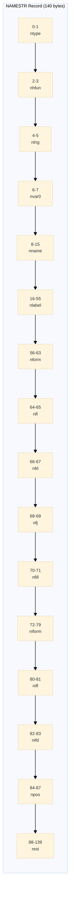

# NAMESTR Records

The NAMESTR (Name String) record describes each variable in the dataset. Each record is exactly **140 bytes**.

## NAMESTR Layout



## Complete Field Reference

| Offset | Size | Field | Type | Description |
|--------|------|-------|------|-------------|
| 0-1 | 2 | ntype | i16 | Variable type: 1=numeric, 2=character |
| 2-3 | 2 | nhfun | i16 | Hash function (always 0) |
| 4-5 | 2 | nlng | i16 | Variable length in bytes |
| 6-7 | 2 | nvar0 | i16 | Variable number (1-based) |
| 8-15 | 8 | nname | char[8] | Variable name (space-padded) |
| 16-55 | 40 | nlabel | char[40] | Variable label (space-padded) |
| 56-63 | 8 | nform | char[8] | Display format name |
| 64-65 | 2 | nfl | i16 | Format length |
| 66-67 | 2 | nfd | i16 | Format decimal places |
| 68-69 | 2 | nfj | i16 | Format justification (0=left, 1=right) |
| 70-71 | 2 | nfill | i16 | Unused padding |
| 72-79 | 8 | niform | char[8] | Input format name |
| 80-81 | 2 | nifl | i16 | Informat length |
| 82-83 | 2 | nifd | i16 | Informat decimal places |
| 84-87 | 4 | npos | i32 | Position in observation |
| 88-139 | 52 | rest | char[52] | Reserved (zeros/spaces) |

## Field Details

### ntype (Variable Type)

| Value | Meaning | Storage |
|-------|---------|---------|
| 1 | Numeric | 8 bytes, IBM float |
| 2 | Character | 1-200 bytes, space-padded |

### nlng (Variable Length)

| Type | Valid Range | Notes |
|------|-------------|-------|
| Numeric | Always 8 | IBM float requires 8 bytes |
| Character | 1-200 | FDA maximum is 200 bytes |

### nname (Variable Name)

- **8 bytes**, right-padded with spaces
- Uppercase letters A-Z, digits 0-9, underscore
- Must start with a letter
- Example: `USUBJID ` (note trailing space)

### nlabel (Variable Label)

- **40 bytes**, right-padded with spaces
- Should be descriptive for data reviewers
- Example: `Unique Subject Identifier           `

### Format Fields (nform, nfl, nfd, nfj)

The display format is stored across four fields:

```rust
// Example: DATE9. format
nform = "DATE    "   // Format name (8 bytes, space-padded)
nfl = 9              // Total width
nfd = 0              // Decimal places
nfj = 0              // Justification (0=left, 1=right)

// Example: 8.2 format (numeric with 2 decimals)
nform = "        "   // No named format
nfl = 8              // Total width
nfd = 2              // Decimal places
nfj = 1              // Right-justified (typical for numbers)

// Example: $CHAR200. format
nform = "$CHAR   "   // Format name with $ prefix
nfl = 200            // Total width
nfd = 0              // Not applicable for character
nfj = 0              // Left-justified (typical for text)
```

### Informat Fields (niform, nifl, nifd)

Input format mirrors the display format structure but without justification:

| Field | Size | Description |
|-------|------|-------------|
| niform | 8 | Input format name |
| nifl | 2 | Input format length |
| nifd | 2 | Input format decimals |

### npos (Position in Observation)

The byte offset of this variable within each observation row:

```
Observation Row:
[STUDYID      ][USUBJID      ][AGE     ][SEX]
^              ^              ^         ^
npos=0         npos=20        npos=60   npos=68
```

## Parsing NAMESTR in Rust

```rust
use std::io::{Read, Cursor};
use byteorder::{BigEndian, ReadBytesExt};

struct Namestr {
    ntype: i16,
    nlng: i16,
    nvar0: i16,
    nname: String,
    nlabel: String,
    nform: String,
    nfl: i16,
    nfd: i16,
    nfj: i16,
    niform: String,
    nifl: i16,
    nifd: i16,
    npos: i32,
}

fn parse_namestr(bytes: &[u8; 140]) -> Namestr {
    let mut cursor = Cursor::new(bytes);
    
    let ntype = cursor.read_i16::<BigEndian>().unwrap();
    let _nhfun = cursor.read_i16::<BigEndian>().unwrap();
    let nlng = cursor.read_i16::<BigEndian>().unwrap();
    let nvar0 = cursor.read_i16::<BigEndian>().unwrap();
    
    let mut nname = [0u8; 8];
    cursor.read_exact(&mut nname).unwrap();
    let nname = String::from_utf8_lossy(&nname).trim_end().to_string();
    
    let mut nlabel = [0u8; 40];
    cursor.read_exact(&mut nlabel).unwrap();
    let nlabel = String::from_utf8_lossy(&nlabel).trim_end().to_string();
    
    // ... continue for remaining fields
    
    Namestr { ntype, nlng, nvar0, nname, nlabel, /* ... */ }
}
```

## Writing NAMESTR in Rust

```rust
use std::io::Write;
use byteorder::{BigEndian, WriteBytesExt};

fn write_namestr<W: Write>(w: &mut W, var: &Variable, pos: i32) -> std::io::Result<()> {
    // ntype
    w.write_i16::<BigEndian>(if var.is_numeric { 1 } else { 2 })?;
    
    // nhfun (always 0)
    w.write_i16::<BigEndian>(0)?;
    
    // nlng
    w.write_i16::<BigEndian>(var.length as i16)?;
    
    // nvar0 (1-based variable number)
    w.write_i16::<BigEndian>(var.index as i16 + 1)?;
    
    // nname (8 bytes, space-padded)
    let mut name = [b' '; 8];
    name[..var.name.len().min(8)].copy_from_slice(var.name.as_bytes());
    w.write_all(&name)?;
    
    // nlabel (40 bytes, space-padded)
    let mut label = [b' '; 40];
    label[..var.label.len().min(40)].copy_from_slice(var.label.as_bytes());
    w.write_all(&label)?;
    
    // Format fields...
    // Informat fields...
    // npos
    w.write_i32::<BigEndian>(pos)?;
    
    // rest (52 bytes of zeros)
    w.write_all(&[0u8; 52])?;
    
    Ok(())
}
```

## xportrs Format API

xportrs provides a high-level API for format handling:

```rust
use xportrs::{Column, ColumnData, Format};

// Create column with format metadata
let col = Column::new("AESTDTC", ColumnData::F64(vec![Some(23391.0)]))
    .with_label("Start Date/Time")
    .with_format(Format::parse("DATE9.").unwrap());

// The Format struct extracts:
// - name: "DATE"
// - length: 9
// - decimals: 0
// - justification: Right (default for formats)
```

## Common Formats

| Format | nform | nfl | nfd | Description |
|--------|-------|-----|-----|-------------|
| `DATE9.` | `DATE    ` | 9 | 0 | Date (01JAN2024) |
| `DATETIME20.` | `DATETIME` | 20 | 0 | Date and time |
| `8.2` | `        ` | 8 | 2 | Numeric with 2 decimals |
| `BEST12.` | `BEST    ` | 12 | 0 | Best representation |
| `$CHAR200.` | `$CHAR   ` | 200 | 0 | Character (200 bytes) |
| `$200.` | `$       ` | 200 | 0 | Character shorthand |

> [!TIP]
> For FDA submissions, avoid custom formats. Use standard SAS formats like DATE9., DATETIME20., and simple numeric formats.
