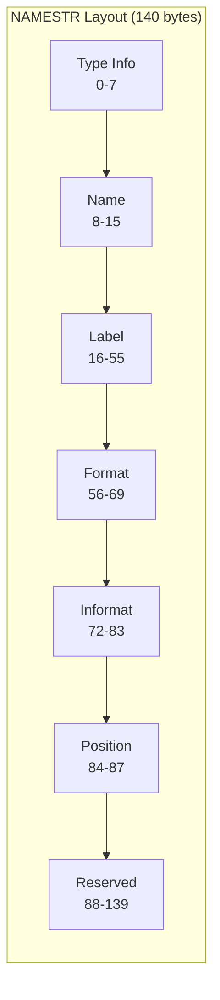

# XPT File Structure

This page provides a detailed overview of the XPT V5 file structure.

## Overall Structure

An XPT file consists of a library (file) level and one or more member (dataset) levels:

```mermaid
graph TB
    subgraph "XPT V5 File"
        LH["Library Header<br/>80 bytes"]
        
        subgraph "Member 1 (Dataset)"
            MH1["Member Header<br/>80 bytes"]
            DC1["DSCRPTR Header<br/>80 bytes"]
            DD1["Dataset Descriptor<br/>160 bytes"]
            NSH1["NAMESTR Header<br/>80 bytes"]
            NS1["NAMESTR Records<br/>140 bytes × n"]
            OH1["OBS Header<br/>80 bytes"]
            OBS1["Observation Data"]
        end
        
        subgraph "Member 2 (Optional)"
            MH2["Member Header"]
            MORE2["..."]
        end
        
        LH --> MH1
        MH1 --> DC1
        DC1 --> DD1
        DD1 --> NSH1
        NSH1 --> NS1
        NS1 --> OH1
        OH1 --> OBS1
        OBS1 --> MH2
        MH2 --> MORE2
    end
```



## Header Records

All headers are exactly **80 bytes** with a distinctive pattern:

```
HEADER RECORD*******<type> HEADER RECORD!!!!!!!<numbers>
```

### Library Header

```
HEADER RECORD*******LIBRARY HEADER RECORD!!!!!!!000000000000000000000000000000  
```

This header identifies the file as an XPT transport file.

### Member Header

```
HEADER RECORD*******MEMBER  HEADER RECORD!!!!!!!000000000000000001600000000140  
```

The numbers indicate:
- `00000016` (hex) = 22 bytes for version information
- `00000140` (decimal) = 140 bytes per NAMESTR record

### DSCRPTR Header

```
HEADER RECORD*******DSCRPTR HEADER RECORD!!!!!!!000000000000000000000000000000  
```

Introduces the dataset descriptor records.

### NAMESTR Header

```
HEADER RECORD*******NAMESTR HEADER RECORD!!!!!!!000000000000000000000000000000  
```

The variable count is embedded in positions 54-57.

### OBS Header

```
HEADER RECORD*******OBS     HEADER RECORD!!!!!!!000000000000000000000000000000  
```

Introduces the observation data section.

## Dataset Descriptor

The dataset descriptor spans **two 80-byte records** (160 bytes total):

### First Record (80 bytes)

| Offset | Size | Field | Example |
|--------|------|-------|---------|
| 0-7 | 8 | sas1 | `SAS     ` |
| 8-15 | 8 | sas2 | `SAS     ` |
| 16-23 | 8 | saslib | `SASLIB  ` |
| 24-31 | 8 | version | `9.4     ` |
| 32-39 | 8 | os | `X64_10HO` |
| 40-47 | 8 | blanks | `        ` |
| 48-63 | 16 | created | `01JAN24:00:00:00` |
| 64-79 | 16 | modified | `01JAN24:00:00:00` |

### Second Record (80 bytes)

| Offset | Size | Field | Example |
|--------|------|-------|---------|
| 0-7 | 8 | dsname | `AE      ` |
| 8-15 | 8 | sasdata | `SASDATA ` |
| 16-23 | 8 | version | `9.4     ` |
| 24-31 | 8 | os | `X64_10HO` |
| 32-39 | 8 | blanks | `        ` |
| 40-79 | 40 | label | `Adverse Events` |

## NAMESTR Section

After the NAMESTR header, each variable is described by a 140-byte NAMESTR record:



See [NAMESTR Records](namestr.md) for the complete byte-by-byte layout.

### NAMESTR Padding

NAMESTR records are packed into 80-byte physical records. Since 140 bytes doesn't divide evenly into 80:

- **5 NAMESTRs = 700 bytes = 8.75 records** → pad to 720 bytes (9 records)
- Formula: `ceil(n_vars * 140 / 80) * 80`

## Observation Data

After the OBS header, data is stored in row-major order:

```
[Row 1]──[Var 1][Var 2][Var 3]...[Var N]
[Row 2]──[Var 1][Var 2][Var 3]...[Var N]
...
[Row M]──[Var 1][Var 2][Var 3]...[Var N]
[Padding to 80-byte boundary]
```

### Row Length Calculation

```rust
fn row_length(variables: &[Variable]) -> usize {
    variables.iter().map(|v| {
        if v.is_numeric() {
            8  // Always 8 bytes for numerics
        } else {
            v.length  // 1-200 bytes for characters
        }
    }).sum()
}
```

### End-of-File Padding

The file ends with space padding (`0x20`) to reach an 80-byte boundary.

## Byte Order

All multi-byte integers are **big-endian**:

```rust
// Reading a 16-bit integer from XPT
let value = i16::from_be_bytes([bytes[0], bytes[1]]);

// Writing a 16-bit integer to XPT
let bytes = value.to_be_bytes();
```

## Character Encoding

| Region | Encoding | Notes |
|--------|----------|-------|
| FDA (US) | ASCII | Required |
| PMDA (Japan) | Shift-JIS | Extended |
| General | Latin-1 | Common |

> [!IMPORTANT]
> For FDA submissions, use ASCII only. xportrs validates this when `Agency::FDA` is specified.

## Example File (Hex Dump)

```
00000000: 4845 4144 4552 2052 4543 4f52 442a 2a2a  HEADER RECORD***
00000010: 2a2a 2a2a 4c49 4252 4152 5920 4845 4144  ****LIBRARY HEAD
00000020: 4552 2052 4543 4f52 4421 2121 2121 2121  ER RECORD!!!!!!!
00000030: 3030 3030 3030 3030 3030 3030 3030 3030  0000000000000000
00000040: 3030 3030 3030 3030 3030 3030 3030 2020  00000000000000  
```

## Multi-Member Files

XPT files can contain multiple datasets (members). Each member has its own:
- Member header
- Dataset descriptor
- NAMESTR section
- Observation data

```rust
use xportrs::Xpt;

// Reading all members
let datasets = Xpt::read_all("multi.xpt")?;
for ds in datasets {
    println!("Dataset: {}", ds.domain_code());
}
```

> [!NOTE]
> For FDA submissions, it's common practice to use one dataset per file, but the format supports multiple.
