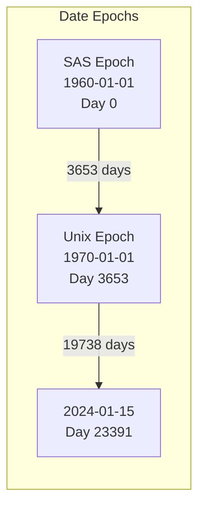

# Timestamps and Dates

XPT files use the **SAS date system** for timestamps and dates. This page explains date handling in xportrs.

## SAS Epoch

SAS uses **January 1, 1960** as its epoch (day zero), different from Unix (1970):



## Date Types

| Type | Storage | Unit | Example Format |
|------|---------|------|----------------|
| Date | f64 | Days since 1960-01-01 | `DATE9.` |
| Time | f64 | Seconds since midnight | `TIME8.` |
| DateTime | f64 | Seconds since 1960-01-01 00:00:00 | `DATETIME20.` |

## Conversion Formulas

### Date Conversions

```rust
use chrono::{NaiveDate, Datelike};

// SAS epoch
const SAS_EPOCH: NaiveDate = NaiveDate::from_ymd_opt(1960, 1, 1).unwrap();

/// Convert NaiveDate to SAS date number
fn to_sas_date(date: NaiveDate) -> f64 {
    (date - SAS_EPOCH).num_days() as f64
}

/// Convert SAS date number to NaiveDate
fn from_sas_date(sas_date: f64) -> NaiveDate {
    SAS_EPOCH + chrono::Duration::days(sas_date as i64)
}

// Examples:
// 1960-01-01 → 0
// 1970-01-01 → 3653
// 2024-01-15 → 23391
```

### DateTime Conversions

```rust
use chrono::{NaiveDateTime, NaiveDate, NaiveTime};

/// Convert NaiveDateTime to SAS datetime number
fn to_sas_datetime(dt: NaiveDateTime) -> f64 {
    let epoch = NaiveDateTime::new(
        NaiveDate::from_ymd_opt(1960, 1, 1).unwrap(),
        NaiveTime::from_hms_opt(0, 0, 0).unwrap(),
    );
    (dt - epoch).num_seconds() as f64
}

/// Convert SAS datetime number to NaiveDateTime
fn from_sas_datetime(sas_dt: f64) -> NaiveDateTime {
    let epoch = NaiveDateTime::new(
        NaiveDate::from_ymd_opt(1960, 1, 1).unwrap(),
        NaiveTime::from_hms_opt(0, 0, 0).unwrap(),
    );
    epoch + chrono::Duration::seconds(sas_dt as i64)
}
```

### Time Conversions

```rust
use chrono::NaiveTime;

/// Convert NaiveTime to SAS time number
fn to_sas_time(time: NaiveTime) -> f64 {
    time.num_seconds_from_midnight() as f64
}

/// Convert SAS time number to NaiveTime
fn from_sas_time(sas_time: f64) -> NaiveTime {
    let seconds = sas_time as u32;
    NaiveTime::from_num_seconds_from_midnight_opt(seconds, 0).unwrap()
}
```

## Date Formats

### Common Date Formats

| Format | Example Output | Description |
|--------|---------------|-------------|
| `DATE9.` | `15JAN2024` | Standard SAS date |
| `DATE7.` | `15JAN24` | Short year |
| `MMDDYY10.` | `01/15/2024` | US format |
| `DDMMYY10.` | `15/01/2024` | European format |
| `YYMMDD10.` | `2024-01-15` | ISO format |
| `E8601DA.` | `2024-01-15` | ISO 8601 |

### DateTime Formats

| Format | Example Output |
|--------|---------------|
| `DATETIME20.` | `15JAN2024:14:30:00` |
| `E8601DT.` | `2024-01-15T14:30:00` |

### Time Formats

| Format | Example Output |
|--------|---------------|
| `TIME8.` | `14:30:00` |
| `TIME5.` | `14:30` |
| `HHMM.` | `14:30` |

## Using Dates in xportrs

### Storing as Numeric with Format

```rust
use xportrs::{Column, ColumnData, Format};

// Calculate SAS date for 2024-01-15
let sas_date = 23391.0;  // Days since 1960-01-01

Column::new("AESTDT", ColumnData::F64(vec![Some(sas_date)]))
    .with_label("Start Date")
    .with_format_str("DATE9.")?
```

### Storing as ISO 8601 String (Recommended)

For SDTM submissions, dates are typically stored as ISO 8601 character strings:

```rust
use xportrs::{Column, ColumnData, Format};

// ISO 8601 date string
Column::new("AESTDTC", ColumnData::String(vec![Some("2024-01-15".into())]))
    .with_label("Start Date/Time of Adverse Event")
    .with_format(Format::character(19))
    .with_length(19)
```

> [!TIP]
> SDTM uses `--DTC` variables (character) for dates/times, while ADaM often uses `--DT`/`--TM` (numeric) variables with date formats.

## Partial Dates

SDTM allows partial dates in character variables:

| Precision | Example | Description |
|-----------|---------|-------------|
| Complete | `2024-01-15` | Full date |
| Month | `2024-01` | Unknown day |
| Year | `2024` | Unknown month/day |

```rust
// Partial date examples
let dates = vec![
    Some("2024-01-15".to_string()),  // Complete
    Some("2024-01".to_string()),     // Month only
    Some("2024".to_string()),        // Year only
    None,                             // Missing
];

Column::new("AESTDTC", ColumnData::String(dates))
    .with_label("Start Date/Time")
    .with_format(Format::character(19))
```

## File Timestamps

XPT files contain creation and modification timestamps in the dataset descriptor:

```
Position 48-63: Creation timestamp (ddMMMyy:hh:mm:ss)
Position 64-79: Modified timestamp (ddMMMyy:hh:mm:ss)

Example: "01JAN24:14:30:00"
```

### Reading File Timestamps

```rust
use xportrs::Xpt;

let info = Xpt::inspect("ae.xpt")?;
if let Some(created) = &info.created {
    println!("Created: {}", created);
}
if let Some(modified) = &info.modified {
    println!("Modified: {}", modified);
}
```

## Time Zone Considerations

> [!WARNING]
> XPT files do not store time zone information. All times are assumed to be in the local time zone where the data was collected.

For SDTM submissions:
- Store times in ISO 8601 format with explicit time zone when known
- Document time zone assumptions in the Reviewer's Guide

## Best Practices

1. **Use ISO 8601 for SDTM**: Store dates as character strings (`AESTDTC`) rather than numeric
2. **Use numeric for ADaM**: ADaM analysis dates (`ASTDT`) are typically numeric with formats
3. **Document partial dates**: Use imputation flags (`AESTDTF`) to indicate partial date handling
4. **Consider precision**: Numeric dates have ~15 digit precision; sub-second precision may be lost

## Reference

- [SAS Date, Time, and Datetime Values](https://documentation.sas.com/doc/en/pgmsascdc/9.4_3.5/lrcon/p1wj0wt2ebe2a0n1lv4lem9hdc0v.htm)
- [ISO 8601 Date and Time Format](https://www.iso.org/iso-8601-date-and-time-format.html)
- [SDTM-IG Date/Time Variables](https://www.cdisc.org/standards/foundational/sdtmig)
