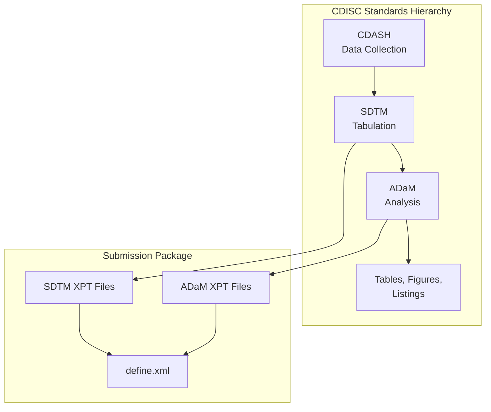
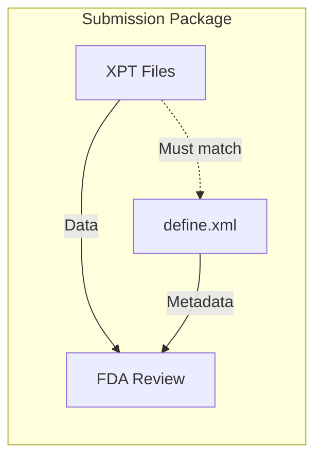

# CDISC Standards

The Clinical Data Interchange Standards Consortium (CDISC) defines the data models and metadata standards used in clinical trial submissions.

## CDISC Data Models



## SDTM (Study Data Tabulation Model)

SDTM is the standard for organizing clinical trial tabulation data. Each domain (dataset) represents a specific type of data:

| Domain | Description             | Common Variables           |
|--------|-------------------------|----------------------------|
| **DM** | Demographics            | STUDYID, USUBJID, AGE, SEX |
| **AE** | Adverse Events          | AETERM, AESTDTC, AESEV     |
| **CM** | Concomitant Medications | CMTRT, CMDOSE              |
| **LB** | Laboratory Results      | LBTESTCD, LBORRES          |
| **VS** | Vital Signs             | VSTESTCD, VSORRES          |
| **EX** | Exposure                | EXTRT, EXDOSE              |

### Creating SDTM Datasets

```rust
use xportrs::{Column, ColumnData, Dataset, Format, Xpt};

// Demographics (DM) domain
let dm = Dataset::with_label("DM", "Demographics", vec![
    Column::new("STUDYID", ColumnData::String(vec![Some("ABC-123".into())]))
        .with_label("Study Identifier"),
    Column::new("USUBJID", ColumnData::String(vec![Some("ABC-123-001".into())]))
        .with_label("Unique Subject Identifier"),
    Column::new("AGE", ColumnData::F64(vec![Some(45.0)]))
        .with_label("Age"),
    Column::new("SEX", ColumnData::String(vec![Some("M".into())]))
        .with_label("Sex"),
    Column::new("RACE", ColumnData::String(vec![Some("WHITE".into())]))
        .with_label("Race"),
]) ?;
```

## ADaM (Analysis Data Model)

ADaM is the standard for analysis datasets derived from SDTM:

| Dataset   | Description             | Purpose             |
|-----------|-------------------------|---------------------|
| **ADSL**  | Subject-Level Analysis  | One row per subject |
| **ADAE**  | Adverse Events Analysis | One row per event   |
| **ADLB**  | Laboratory Analysis     | Derived lab values  |
| **ADTTE** | Time-to-Event           | Survival analysis   |

### Creating ADaM Datasets

```rust
// Subject-Level Analysis Dataset (ADSL)
let adsl = Dataset::with_label("ADSL", "Subject Level Analysis", vec![
    Column::new("STUDYID", ColumnData::String(vec![Some("ABC-123".into())]))
        .with_label("Study Identifier"),
    Column::new("USUBJID", ColumnData::String(vec![Some("ABC-123-001".into())]))
        .with_label("Unique Subject Identifier"),
    Column::new("TRT01P", ColumnData::String(vec![Some("DRUG A".into())]))
        .with_label("Planned Treatment for Period 01"),
    Column::new("TRT01A", ColumnData::String(vec![Some("DRUG A".into())]))
        .with_label("Actual Treatment for Period 01"),
    Column::new("SAFFL", ColumnData::String(vec![Some("Y".into())]))
        .with_label("Safety Population Flag"),
]) ?;
```

## Variable Metadata

CDISC requires specific metadata for each variable:

### Required Metadata

| Metadata        | XPT Field | xportrs Method           |
|-----------------|-----------|--------------------------|
| Variable Name   | `nname`   | `Column::new(name, ...)` |
| Variable Label  | `nlabel`  | `.with_label(...)`       |
| Variable Type   | `ntype`   | Inferred from ColumnData |
| Display Format  | `nform`   | `.with_format(...)`      |
| Variable Length | `nlng`    | `.with_length(...)`      |

### Example with Full Metadata

```rust
Column::new("AESTDTC", ColumnData::String(vec![Some("2024-01-15".into())]))
.with_label("Start Date/Time of Adverse Event")
.with_format(Format::character(19))
.with_length(19)
```

## Controlled Terminology

CDISC defines controlled terminology for many variables:

> [!WARNING]
> xportrs does not validate controlled terminology values. Use Pinnacle 21 or similar tools to verify that coded values match CDISC controlled terminology.

Common controlled terminology:

- **AESEV**: MILD, MODERATE, SEVERE
- **SEX**: M, F, U, UNDIFFERENTIATED
- **RACE**: WHITE, BLACK OR AFRICAN AMERICAN, ASIAN, etc.
- **NY** (Yes/No): Y, N

## SDTM-IG Versions

xportrs supports the latest SDTM-IG metadata requirements:

| Version     | Release Date | Key Changes                           |
|-------------|--------------|---------------------------------------|
| SDTM-IG 3.4 | 2023         | Current recommended                   |
| SDTM-IG 3.3 | 2021         | Labels no longer conformance criteria |
| SDTM-IG 3.2 | 2013         | Legacy support                        |

> [!NOTE]
> As of SDTM-IG 3.3, variable labels are **recommended
** but not required for conformance. However, xportrs still generates warnings for missing labels since they are important for data reviewers.

## Define-XML Integration

The define.xml file provides metadata that complements XPT files:



> [!IMPORTANT]
> Variable labels in XPT files should match those in define.xml. Pinnacle 21 rule SD0063 checks for mismatches.

## Resources

- [CDISC Website](https://www.cdisc.org/)
- [SDTM Implementation Guide](https://www.cdisc.org/standards/foundational/sdtmig)
- [ADaM Implementation Guide](https://www.cdisc.org/standards/foundational/adam)
- [CDISC Controlled Terminology](https://www.cdisc.org/standards/terminology)
