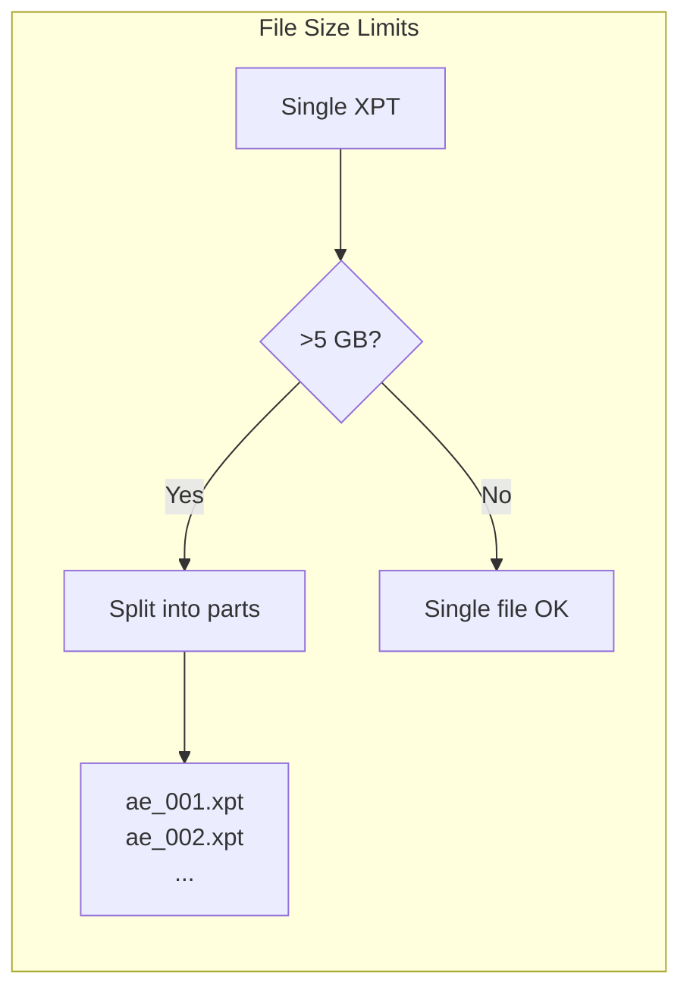

# FDA Technical Conformance Guide

The FDA Study Data Technical Conformance Guide (TCG) defines requirements for electronic study data submissions. This page covers XPT-specific requirements.

## Submission Types

XPT files are required for these FDA submission types:

| Submission Type | Description                   | XPT Required |
|-----------------|-------------------------------|--------------|
| **NDA**         | New Drug Application          | Yes          |
| **ANDA**        | Abbreviated NDA (Generics)    | Yes          |
| **BLA**         | Biologics License Application | Yes          |
| **IND**         | Investigational New Drug      | Conditional  |

## File Size Requirements



### Automatic File Splitting

xportrs automatically handles file splitting:

```rust
use xportrs::Xpt;

// Automatically splits if dataset would exceed 5GB
Xpt::writer(large_dataset)
.max_file_size_gb(5.0)  // Optional, 5.0 is default
.finalize() ?
.write_path("ae.xpt") ?;  // May create ae_001.xpt, ae_002.xpt, ...
```

## Character Encoding

> [!IMPORTANT]
> FDA requires **ASCII-only
** characters in variable names and labels. Extended characters may cause validation failures.

### ASCII Validation

```rust
use xportrs::{Agency, Xpt};

let validated = Xpt::writer(dataset)
.agency(Agency::FDA)  // Enforces ASCII validation
.finalize() ?;

// Non-ASCII characters will generate errors
for issue in validated.issues() {
if format ! ("{}", issue).contains("ASCII") {
eprintln ! ("ASCII violation: {}", issue);
}
}
```

## Variable Requirements

### Naming Conventions

| Requirement               | FDA TCG Section | xportrs Validation |
|---------------------------|-----------------|--------------------|
| 1-8 characters            | Section 4.1.5   | Error if violated  |
| Uppercase only            | Section 4.1.5   | Auto-converted     |
| Start with letter         | Section 4.1.5   | Error if violated  |
| A-Z, 0-9, underscore only | Section 4.1.5   | Error if violated  |

### Label Requirements

| Requirement                   | FDA TCG Section | xportrs Validation |
|-------------------------------|-----------------|--------------------|
| 0-40 characters               | Section 4.1.5   | Error if >40       |
| ASCII only                    | Section 4.1.5   | Error if non-ASCII |
| Recommended for all variables | Section 4.1.5   | Warning if missing |

## Numeric Precision

XPT files use IBM floating-point format with specific precision limits:

| Data Type | IEEE 754 Precision | IBM Float Precision | Notes            |
|-----------|--------------------|---------------------|------------------|
| Integer   | Exact to 2^53      | Exact to ~10^14     | Safe for IDs     |
| Decimal   | ~15-17 digits      | ~14-16 digits       | Slight loss      |
| Date      | Varies             | SAS epoch-based     | Use date formats |

> [!NOTE]
> For maximum precision, consider using the `DATE9.` or
`DATETIME20.` formats for date/time values rather than storing as plain numerics.

## Date Handling

FDA expects dates in specific formats:

### ISO 8601 Character Dates

```rust
// Preferred: Store as ISO 8601 character string
Column::new("AESTDTC", ColumnData::String(vec![Some("2024-01-15".into())]))
.with_label("Start Date/Time of Adverse Event")
.with_format(Format::character(19))
```

### SAS Numeric Dates

```rust
// Alternative: Store as SAS date number
// Days since January 1, 1960
let sas_date = 23_391.0;  // 2024-01-15

Column::new("AESTDT", ColumnData::F64(vec![Some(sas_date)]))
.with_label("Start Date")
.with_format_str("DATE9.") ?
```

## Study Data Reviewer's Guide

FDA recommends including a Reviewer's Guide with submissions. The guide should reference:

- Dataset locations and naming conventions
- Variable naming patterns
- Any deviations from CDISC standards
- Data transformation documentation

## eCTD Placement

XPT files are placed in specific eCTD module locations:

```
m5/
├── datasets/
│   ├── tabulations/
│   │   ├── sdtm/
│   │   │   ├── ae.xpt
│   │   │   ├── dm.xpt
│   │   │   └── define.xml
│   │   └── send/  (nonclinical)
│   └── analysis/
│       └── adam/
│           ├── adsl.xpt
│           ├── adae.xpt
│           └── define.xml
```

## Validation Checklist

Before submission, verify:

- [ ] All XPT files ≤5GB (or properly split)
- [ ] Variable names ≤8 characters, uppercase
- [ ] Variable labels ≤40 characters, ASCII only
- [ ] Dataset names ≤8 characters
- [ ] Character variable lengths ≤200 bytes
- [ ] define.xml present and valid
- [ ] Pinnacle 21 validation passed (or issues documented)

## Resources

- [FDA Study Data Technical Conformance Guide](https://www.fda.gov/media/153632/download)
- [FDA Study Data Standards Resources](https://www.fda.gov/industry/fda-data-standards-advisory-board/study-data-standards-resources)
- [FDA Data Standards Catalog](https://www.fda.gov/regulatory-information/search-fda-guidance-documents/study-data-technical-conformance-guide)
