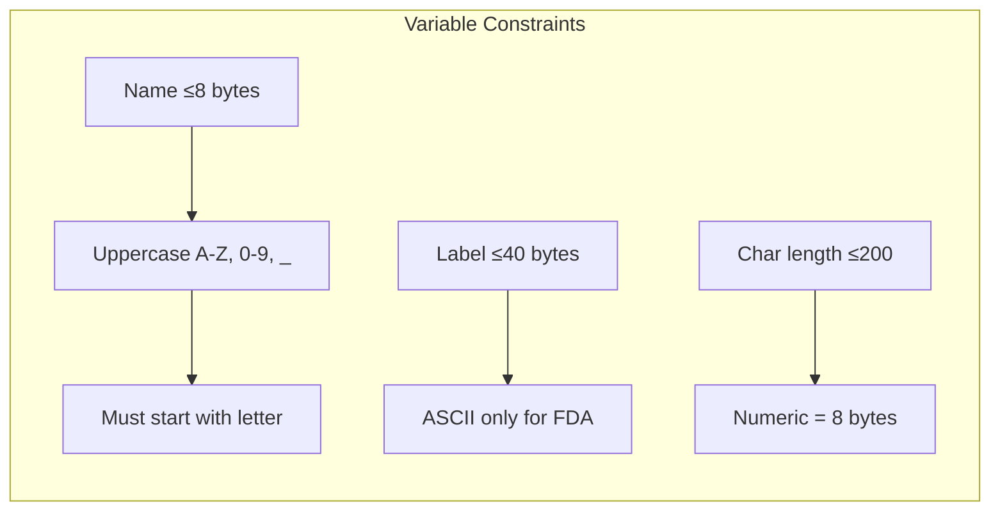

# Regulatory Compliance Overview

xportrs is designed to produce XPT files that meet the requirements of major regulatory agencies for clinical trial data submissions.

## Supported Agencies

| Agency   | Region        | Standards                  | xportrs Support |
|----------|---------------|----------------------------|-----------------|
| **FDA**  | United States | CDISC SDTM/ADaM            | Full validation |
| **PMDA** | Japan         | CDISC + J-SDTM extensions  | Full validation |
| **NMPA** | China         | CDISC + local requirements | Full validation |
| **EMA**  | Europe        | CDISC SDTM/ADaM            | Full validation |

## Key Requirements

All agencies require XPT V5 format files that conform to the SAS Transport specification (TS-140). The key requirements are:

### Variable Requirements



### Dataset Requirements

- **Dataset name**: 1-8 bytes, uppercase alphanumeric
- **Dataset label**: 0-40 bytes (recommended for reviewer clarity)
- **File size**: ≤5GB per file (auto-split supported)

### Format Requirements

XPT files must use:

- **IBM floating-point** encoding (not IEEE 754)
- **Big-endian** byte order
- **SAS epoch** (January 1, 1960) for dates
- **80-byte records** for headers

## Validation Levels

xportrs provides three severity levels for validation issues:

| Severity    | Meaning                   | Example                |
|-------------|---------------------------|------------------------|
| **Error**   | File will not be accepted | Variable name >8 bytes |
| **Warning** | Review recommended        | Missing variable label |
| **Info**    | Best practice suggestion  | Non-standard format    |

> [!IMPORTANT]
> Only **Error** severity issues block file writing. Warnings and info messages are advisory.

## Agency-Specific Rules

### FDA (United States)

The FDA requires strict ASCII compliance for all text:

```rust
use xportrs::{Agency, Xpt};

let validated = Xpt::writer(dataset)
.agency(Agency::FDA)
.finalize() ?;

// Check for FDA-specific issues
for issue in validated.issues() {
println ! ("[{}] {}", issue.severity(), issue);
}
```

### PMDA (Japan)

PMDA allows Shift-JIS encoding for Japanese text in certain fields:

```rust
use xportrs::{Agency, TextMode, Xpt};

let validated = Xpt::writer(dataset)
.agency(Agency::PMDA)
.text_mode(TextMode::Latin1)  // Extended character support
.finalize() ?;
```

### NMPA (China)

NMPA follows CDISC standards with additional local requirements:

```rust
use xportrs::{Agency, Xpt};

let validated = Xpt::writer(dataset)
.agency(Agency::NMPA)
.finalize() ?;
```

## Compliance Verification

### Using xportrs Validation

```rust
let validated = Xpt::writer(dataset)
.agency(Agency::FDA)
.finalize() ?;

// Count issues by severity
let errors = validated.issues().iter()
.filter( | i| i.severity() == Severity::Error)
.count();

if errors > 0 {
eprintln ! ("{} blocking errors found", errors);
}
```

### External Validation (Pinnacle 21)

After generating XPT files, we recommend validation with Pinnacle 21 Community:

1. Download from [Pinnacle 21](https://www.pinnacle21.com/downloads)
2. Run validation against your XPT files and define.xml
3. Review any SD (Study Data) rule violations

> [!NOTE]
> xportrs handles XPT-level compliance. Dataset content validation (controlled terminology, required variables) requires external tools like Pinnacle 21.

## Official Sources

- [FDA Study Data Technical Conformance Guide](https://www.fda.gov/media/153632/download)
- [CDISC SDTM Implementation Guide](https://www.cdisc.org/standards/foundational/sdtmig)
- [SAS TS-140 XPT Specification](https://support.sas.com/content/dam/SAS/support/en/technical-papers/record-layout-of-a-sas-version-5-or-6-data-set-in-sas-transport-xport-format.pdf)
