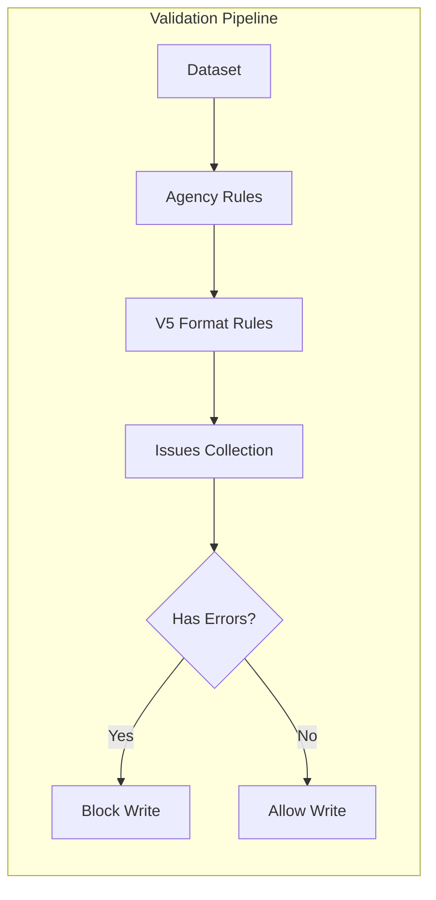

# Validation Rules

xportrs provides built-in validation to catch compliance issues before file writing. This page documents the validation rules and their severity levels.

## Validation Overview



## Severity Levels

| Severity    | Meaning                  | Blocks Write? |
|-------------|--------------------------|---------------|
| **Error**   | File would be rejected   | Yes           |
| **Warning** | Review recommended       | No            |
| **Info**    | Best practice suggestion | No            |

## Built-in Validation Rules

### Variable Name Rules

| Rule               | Severity | Message                                     |
|--------------------|----------|---------------------------------------------|
| Name empty         | Error    | "Variable name cannot be empty"             |
| Name >8 bytes      | Error    | "Variable name exceeds 8 bytes"             |
| Invalid characters | Error    | "Variable name contains invalid characters" |
| Starts with number | Error    | "Variable name must start with a letter"    |

### Variable Label Rules

| Rule            | Severity | Message                                        |
|-----------------|----------|------------------------------------------------|
| Label missing   | Warning  | "Variable 'X' is missing a label"              |
| Label >40 bytes | Error    | "Variable label exceeds 40 bytes"              |
| Non-ASCII (FDA) | Error    | "Variable label contains non-ASCII characters" |

### Dataset Rules

| Rule            | Severity | Message                          |
|-----------------|----------|----------------------------------|
| Name empty      | Error    | "Dataset name cannot be empty"   |
| Name >8 bytes   | Error    | "Dataset name exceeds 8 bytes"   |
| Label missing   | Warning  | "Dataset is missing a label"     |
| Label >40 bytes | Error    | "Dataset label exceeds 40 bytes" |

### Data Rules

| Rule                   | Severity | Message                             |
|------------------------|----------|-------------------------------------|
| Column length mismatch | Error    | "Columns have different lengths"    |
| Character >200 bytes   | Error    | "Character value exceeds 200 bytes" |

## Using Validation

### Basic Validation

```rust
use xportrs::Xpt;

let validated = Xpt::writer(dataset).finalize() ?;

// Check for any issues
if validated.has_errors() {
eprintln ! ("Cannot write file due to errors:");
for issue in validated.issues() {
if issue.severity() == xportrs::Severity::Error {
eprintln ! ("  ERROR: {}", issue);
}
}
return Err("Validation failed".into());
}

// Proceed with write
validated.write_path("output.xpt") ?;
```

### Agency-Specific Validation

```rust
use xportrs::{Agency, Xpt};

// FDA validation (strict ASCII)
let fda_validated = Xpt::writer(dataset.clone())
.agency(Agency::FDA)
.finalize() ?;

// PMDA validation (allows extended characters)
let pmda_validated = Xpt::writer(dataset)
.agency(Agency::PMDA)
.finalize() ?;
```

### Filtering Issues

```rust
use xportrs::{Severity, Xpt};

let validated = Xpt::writer(dataset).finalize() ?;

// Get only errors
let errors: Vec<_ > = validated.issues()
.iter()
.filter( | i| i.severity() == Severity::Error)
.collect();

// Get only warnings
let warnings: Vec<_ > = validated.issues()
.iter()
.filter( | i| i.severity() == Severity::Warning)
.collect();
```

### Checking Specific Variables

```rust
let validated = Xpt::writer(dataset).finalize() ?;

for issue in validated.issues() {
// Check what the issue targets
match issue.target() {
"USUBJID" => println ! ("Issue with USUBJID: {}", issue),
"AESEQ" => println ! ("Issue with AESEQ: {}", issue),
_ => {}
}
}
```

## Pinnacle 21 Rules

xportrs validation covers XPT-level rules. For full CDISC compliance, use Pinnacle 21:

### Rules Covered by xportrs

| Pinnacle 21 Rule | Description                       | xportrs   |
|------------------|-----------------------------------|-----------|
| SD1001           | Variable name >8 characters       | ✅ Error   |
| SD1002           | Variable label >40 characters     | ✅ Error   |
| SD0063           | Missing/mismatched variable label | ✅ Warning |
| SD0063A          | Missing/mismatched dataset label  | ✅ Warning |

### Rules Requiring External Validation

| Pinnacle 21 Rule | Description                       | Why External           |
|------------------|-----------------------------------|------------------------|
| SD0001           | Missing required variable         | Domain-specific        |
| SD0002           | Null value in required field      | Data content           |
| SD0060           | Variable not in define.xml        | Requires define.xml    |
| CT2002           | Invalid controlled terminology    | Requires CDISC CT      |
| SE0063           | Label doesn't match SDTM standard | Requires SDTM metadata |

## Custom Validation

You can add custom validation before writing:

```rust
use xportrs::{Dataset, Xpt};

fn validate_custom(dataset: &Dataset) -> Vec<String> {
    let mut issues = vec![];

    // Check for required variables
    let required = ["STUDYID", "USUBJID"];
    for var in required {
        if dataset.column(var).is_none() {
            issues.push(format!("Missing required variable: {}", var));
        }
    }

    // Check STUDYID consistency
    if let Some(col) = dataset.column("STUDYID") {
        if let xportrs::ColumnData::String(values) = col.data() {
            let first = values.first().and_then(|v| v.as_ref());
            for (i, value) in values.iter().enumerate() {
                if value.as_ref() != first {
                    issues.push(format!("STUDYID inconsistent at row {}", i));
                }
            }
        }
    }

    issues
}

fn main() -> xportrs::Result<()> {
    let dataset = /* ... */;

    // Custom validation
    let custom_issues = validate_custom(&dataset);
    if !custom_issues.is_empty() {
        for issue in custom_issues {
            eprintln!("Custom validation: {}", issue);
        }
        return Err(xportrs::Error::invalid_data("Custom validation failed"));
    }

    // xportrs validation
    let validated = Xpt::writer(dataset).finalize()?;
    validated.write_path("output.xpt")?;

    Ok(())
}
```

## Validation Best Practices

> [!TIP]
> Run validation early in your pipeline to catch issues before processing large datasets.

1. **Validate incrementally**: Check validation after each transformation step
2. **Log all issues**: Even warnings may indicate data quality problems
3. **Use agency-specific validation**: Different agencies have different requirements
4. **Combine with Pinnacle 21**: xportrs + Pinnacle 21 provides comprehensive coverage
5. **Document exceptions**: If you must ship with warnings, document why
