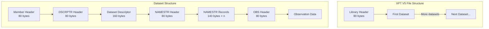

# XPT V5 Specification

The XPT V5 format is defined by the SAS Technical Note TS-140. This page provides a comprehensive overview of the format.

## Format Overview

XPT V5 (also known as SAS Transport Version 5) is a binary file format with:

- **80-byte records** for headers
- **Big-endian** byte order
- **IBM floating-point** number encoding
- **Fixed-width** text fields (space-padded)



## Library Header

The file begins with a library header identifying the format:

| Offset | Size | Content                                                                            |
|--------|------|------------------------------------------------------------------------------------|
| 0-79   | 80   | `HEADER RECORD*******LIBRARY HEADER RECORD!!!!!!!000000000000000000000000000000  ` |

```rust
const LIBRARY_HEADER: &[u8; 80] =
    b"HEADER RECORD*******LIBRARY HEADER RECORD!!!!!!!000000000000000000000000000000  ";
```

## Member Header

Each dataset (member) begins with a member header:

| Offset | Size | Content                                                                            |
|--------|------|------------------------------------------------------------------------------------|
| 0-79   | 80   | `HEADER RECORD*******MEMBER  HEADER RECORD!!!!!!!000000000000000001600000000140  ` |

The numbers at the end indicate:

- `00000016` = 16 bytes for dataset descriptor (hex)
- `0000014` = 140 bytes per NAMESTR record (decimal)

## Dataset Descriptor

The dataset descriptor contains:

| Offset | Size | Field    | Description        |
|--------|------|----------|--------------------|
| 0-7    | 8    | SAS      | `SAS     `         |
| 8-15   | 8    | SAS      | `SAS     `         |
| 16-23  | 8    | SASLIB   | `SASLIB  `         |
| 24-31  | 8    | Version  | `9.4     `         |
| 32-39  | 8    | OS       | Operating system   |
| 40-47  | 8    | Blanks   | Padding            |
| 48-63  | 16   | Created  | `ddMMMyy:hh:mm:ss` |
| 64-79  | 16   | Modified | `ddMMMyy:hh:mm:ss` |

### Second Descriptor Record

| Offset | Size | Field   | Description      |
|--------|------|---------|------------------|
| 0-7    | 8    | DSNAME  | Dataset name     |
| 8-15   | 8    | SASDATA | `SASDATA `       |
| 16-23  | 8    | Version | `9.4     `       |
| 24-31  | 8    | OS      | Operating system |
| 32-39  | 8    | Blanks  | Padding          |
| 40-79  | 40   | Label   | Dataset label    |

## NAMESTR Records

The NAMESTR header introduces the variable metadata:

| Offset | Size | Content                                            |
|--------|------|----------------------------------------------------|
| 0-53   | 54   | `HEADER RECORD*******NAMESTR HEADER RECORD!!!!!!!` |
| 54-57  | 4    | Number of variables (zero-padded)                  |
| 58-79  | 22   | Padding                                            |

Each variable is described by a 140-byte NAMESTR record. See [NAMESTR Records](../format/namestr.md) for detailed byte layout.

## Observation Data

The observation header introduces the data:

| Offset | Size | Content                                                                            |
|--------|------|------------------------------------------------------------------------------------|
| 0-79   | 80   | `HEADER RECORD*******OBS     HEADER RECORD!!!!!!!000000000000000000000000000000  ` |

After this, raw observation data follows in row-major order:

```
[Row 1: Var1][Row 1: Var2]...[Row 1: VarN]
[Row 2: Var1][Row 2: Var2]...[Row 2: VarN]
...
```

### Numeric Variables

All numeric variables are stored as 8-byte IBM floating-point:

- **8 bytes** per value
- **Big-endian** byte order
- **IBM base-16** exponent (not IEEE 754)

### Character Variables

Character variables are stored as fixed-width text:

- **1-200 bytes** per value (as defined in NAMESTR)
- **Space-padded** on the right
- **No null terminators**

### Missing Values

| Type                      | Encoding                              |
|---------------------------|---------------------------------------|
| Numeric missing (`.`)     | `0x2E` in first byte, zeros elsewhere |
| Numeric missing (`.A-.Z`) | `0x41-0x5A` in first byte             |
| Character missing         | All spaces                            |

## Record Padding

XPT uses 80-byte record alignment:

- NAMESTR records: 140 bytes (not aligned)
- Multiple NAMESTRs fill to 80-byte boundary
- Observation rows: variable length (row_length × n)
- File ends with space padding to 80 bytes

## Version Differences

| Feature              | V5 (TS-140)   | V8+       |
|----------------------|---------------|-----------|
| Variable name length | 8 bytes       | 32 bytes  |
| Label length         | 40 bytes      | 256 bytes |
| Number encoding      | IBM float     | IEEE 754  |
| Max observations     | ~2 billion    | Unlimited |
| Regulatory support   | FDA/PMDA/NMPA | Limited   |

> [!IMPORTANT]
> For regulatory submissions, **only V5 format is accepted**. xportrs focuses on V5 compliance.

## Official Specification

The authoritative source for XPT V5 format is:

**SAS Technical Note TS-140: Record Layout of a SAS Version 5 or 6 Data Set in SAS Transport (XPORT) Format**

<iframe
    src="../assets/pdfs/ts-140-xpt-v5-v6-spec.pdf"
    width="100%"
    height="600px"
    style="border: 1px solid #ccc; border-radius: 4px;">
</iframe>

<p style="text-align: center; margin-top: 10px;">
<a href="../assets/pdfs/ts-140-xpt-v5-v6-spec.pdf" download>Download PDF</a> |
<a href="https://support.sas.com/content/dam/SAS/support/en/technical-papers/record-layout-of-a-sas-version-5-or-6-data-set-in-sas-transport-xport-format.pdf" target="_blank">View on SAS Support</a>
</p>

## Format Family

The Library of Congress maintains format documentation:

- [XPT Format Family](https://www.loc.gov/preservation/digital/formats/fdd/fdd000464.shtml)
- [XPT V5 Specific](https://www.loc.gov/preservation/digital/formats/fdd/fdd000466.shtml)
